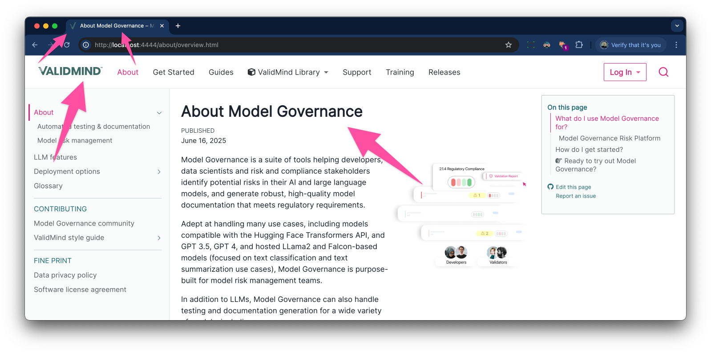

# ValidMind


This is the home for the user-facing documentation and related infrastructure for ValidMind. If you want to make updates to our external docs site, you're in the right place!

## Contributing to the documentation

We believe in the power of collaboration and welcome contributions from the community. If you've noticed an issue or have ideas for improvement, please create a pull request or submit an issue. A member of ValidMind's documentation team will review your suggestions and support you in contributing to the docs. 

- Follow the [Quickstart](https://docs.validmind.ai/get-started/developer/try-with-jupyterhub.html) for a 15-minute introduction to the ValidMind Library and ValidMind Platform.

- Read the [ValidMind Library docs](https://docs.validmind.ai/developer/get-started-validmind-library.html) for more information about ValidMind's open source tests and Jupyter notebooks.

- Join the [Community Slack](https://docs.validmind.ai/about/contributing/join-community.html) to ask questions, get support, and connect with Model Risk Management (MRM) practioners.

## Prerequisites

We use [Quarto](https://quarto.org) to develop our docs site, an open-source docs framework based on Pandoc that supports multiple input formats such as Quarto Markdown, Jupyter notebooks, and Markdown.

You need:

- [Quarto CLI](https://quarto.org/docs/get-started/)
- The Quarto extension for your IDE, such as [VS Code](https://marketplace.visualstudio.com/items?itemName=quarto.quarto)
- For Windows operating systems, install the `make` command via [Cygwin](https://cygwin.com/install.html)

### Additional dependencies

Some interactive tables, such as our breaking changes and dependency history rely you have R and some R packages installed in order for you to be able to preview or render certain pages of the docs site locally.

**Refer to the [Breaking changes and deprecations](site/releases/breaking-changes/README.md) guide** for more information on how to install R and set up these tables.

## How to contribute

> [!IMPORTANT]
> First, read through and familiarize yourself with our [ValidMind style guide](https://docs.validmind.ai/about/contributing/style-guide/style-guide.html).

- Our core user guides are sourced in Quarto Markdown under [`site/guide`](https://github.com/validmind/documentation/tree/main/site/guide). 
- If you create new documentation, make sure to add it to the [`_quarto.yml`](https://github.com/validmind/documentation/blob/main/site/_quarto.yml) file.

If you are creating a pull request, test your changes by rendering or previewing the site. Note that if this is your first time contributing, you will be asked to sign a contributor license agreement (CLA).

### Preview the docs site

To get an accurate preview of the docs site, specify a Quarto profile:

```bash
cd site
quarto preview --profile development
```

Supported profiles:

- `development`: For developing new product documentation or docs site features
- `staging`: To preview the staging docs site after checking out the `staging` branch
- `production`: To preview the production docs site after checking out the `prod` branch
- `docker`: Not recommended; follow the steps in [local development with Kind](#local-development-with-kind)

### Render the docs site

To render the production docs site:

```bash
cd site
quarto render --profile production
```

Supports the same profiles as preview.

The rendered static HTML output lives in:

```bash
site
└── _site ...
    └── *.html, *.css, *.png, *.js ...
```

## Directory map

### `site`
Core files you manipulate live under `site` in these key directories that more or less correlate to the sections of the docs site reachable via the top navigation bar:

- `about` 
- `developer` 
- `faq` 
- `get-started` 
- `guide`  
- `support` 

These directories may have sub-directories depending on their size and grouped sub-topics contained within. 

#### Special `site` directories
- `releases` — Correlates to the "Releases" section under [About](https://docs.validmind.ai/about/overview.html).
- `training` — Correlates to the "Training" section under [Get Started](https://docs.validmind.ai/training/training-overview.html).

#### Supporting `site` directories
- `_site` — This is where static files rendered by `quarto render` get placed.
- `assets` — This is where general shared assets live (stylesheets, promotional images, all videos, etc.).
- `internal` — For internal testing only.
- `notebooks` — This is where notebooks retrieved from the [`validmind-library` repo](https://github.com/validmind/validmind-library) live.
- `tests` — This is where test descriptions generated from the Python source in the [`validmind-library` repo](https://github.com/validmind/validmind-library) live.

#### Stylesheet organization (IN PROGRESS)

The site uses a modular stylesheet architecture to maintain organized and maintainable styles:

```
site/
├── assets/
│   └── styles/
│       ├── _bug-fixes.scss      # Bug fixes and CSS conflict resolutions
│       ├── _codeblocks.scss     # All code block and syntax highlighting styles
│       ├── _termsfeed.scss      # Cookie consent styles
│       ├── _buttons.scss        # Button styles
│       └── _links.scss          # Link styles
├── styles.css                   # Global CSS styles
├── theme-dark.scss              # Dark theme styles (NOT CURRENTLY USED)
└── theme.scss                   # Light theme styles with modular imports
```

> [!NOTE]
> **IN PROGRESS**: To make our styles more manageable, we’re gradually moving classes out of `styles.css` and into modular files imported in `theme.scss`. If you need to touch `styles.css`, consider moving all of the classes related to your change into a modular file at the same time.

### Auxiliary `internal` directories

- `templates` — You can find generic structural templates in this folder here to help you build your guides.
- `testing` — When tests are complete, they get moved here from `site/internal`.

## Working with files

### `.qmd`

Files for the docs site are created using [Quarto Markdown](https://quarto.org/docs/authoring/markdown-basics.html) (`.qmd`). These, along with any Jupyter Notebooks pulled in from `validmind-library`, get rendered into HTML files. 

#### Hyperlinks

When constructing links, refer to the `.qmd` file as Quarto will properly render these into `.html` links on your behalf and check to see if the destinations are able to be resolved:

| Correct | Incorrect |
|---|---|
| `[Quickstart — Model Development](get-started/developer/quickstart-developer.qmd)` | `[Quickstart — Model Development](get-started/developer/quickstart-developer.html)` |

When constructing filepaths, including while using [Quarto's Includes](https://quarto.org/docs/authoring/includes.html) (single-sourcing feature), you'll also want start with the root directory whenever possible as this minimizes usage of unclear relative paths: 

| Correct | Incorrect |
|---|---|
| `[Register models in the inventory](/guide/model-inventory/register-models-in-inventory.qmd)` | `[Register models in the inventory](../../register-models-in-inventory.qmd)` |

### Column layouts

Use the installed [Tachyons Extension For Quarto](https://github.com/nareal/tachyons) to build column layouts so that they are properly mobile responsive. 

Refer to the [`tachyons-flexbox.qmd`](templates/tachyons-flexbox.qmd) template for an example.

### Asset files

If there are additional files that Quarto does not copy over automatically, place them into `/assets`. These files might include: 

- Videos
- Stylesheets
- Font files

### Jupyter Notebooks

Notebooks (`.ipynb` files) are NOT edited via this `documentation` repo, as any changes will be overridden. 

Changes need to be made in the [root repository `validmind-library`](https://github.com/validmind/validmind-library) and pulled into this one with:

```bash
make get-source
```

After you pull in the changes, commit them to this repo as part of the release notes process.

> [!TIP]
> **Want to author new code samples?** Refer to our [Jupyter Notebook template Quickstart](https://github.com/validmind/validmind-library/tree/main/notebooks/templates)!

<!-- September 16, 2024: Need to mention rendered Python `.html` docs and generated `.md` test descriptions -->

## Local development with Kind

For local development and testing, you can run the docs site in a Kubernetes environment using Kind (Kubernetes in Docker).

### Quickstart

```bash
# Install Kind on macOS
brew install kind

# Render the docs site, build the Docker image, and generate validmind-docs.yaml
cd site
make docker-build

# Start Kind cluster and deploy docs
make kind-serve
```

Access the docs site in your browser at http://localhost:4444/.

**Tip:** The container configuration on startup can take up to 60 seconds before http://localhost:4444/ becomes available. Use `make kind-logs` to follow along.

### Additional helpful commands

```bash
make kind-stop      # Stop the Kind cluster
make kind-restart   # Restart with updated configuration
make kind-logs      # View container logs
```

### Configuration files

- **`kind-config.yaml`** — Kind cluster configuration
- **`validmind-docs-deployment.yaml`** — Kubernetes Deployment and Service manifest
- **`site/validmind-docs.yaml`** — ConfigMap with URLs, product names, and logo and favicon (generated on the fly, not stored in GitHub)

### Create a rebranded docs site

Apply a Kubernetes ConfigMap to provide environment-specific configuration for the ValidMind documentation site. This ConfigMap lets you customize the site at runtime without rebuilding the static files.

Supported environment variables:

| Key                   | Description                                                                  |
|-----------------------|------------------------------------------------------------------------------|
| `VALIDMIND_URL`       | Base URL for the ValidMind web application (e.g. staging or production)      |
| `JUPYTERHUB_URL`      | URL to the JupyterHub instance used for running notebooks                    |
| `PRODUCT_NAME_LONG`   | Full product name for use in UI headers and titles                           |
| `PRODUCT_NAME_SHORT`  | Abbreviated product name for compact UI elements                             |
| `LOGO_SVG`            | Inline SVG markup for the application logo (used in headers or splash screens) |
| `FAVICON_SVG`         | Inline SVG markup for the browser favicon                                    |

To provide a working example you can adapt, [custom-validmind-docs.yaml](site/custom-validmind-docs.yaml) includes a ConfigMap that:

- Points to staging for the ValidMind URL
- Changes the product long and short names to be generic
- Changes the logo and favicon colors to all green, from the default pink and green

### Testing ConfigMaps locally

```bash
# Get your environment up
cd site
make docker-build
make kind-serve

# Apply the custom ConfigMap
kubectl apply -f custom-validmind-docs.yaml
kubectl rollout restart deployment/validmind-docs -n cmvm-test

# Verify the configuration changes took effect
make kind-logs
```

You should see output similar to this in the logs:

```bash
❯ make kind-logs

Showing logs from ValidMind docs pod ...
Switched to context "kind-validmind-docs".
/docker-entrypoint.sh: /docker-entrypoint.d/ is not empty, will attempt to perform configuration
/docker-entrypoint.sh: Looking for shell scripts in /docker-entrypoint.d/
/docker-entrypoint.sh: Launching /docker-entrypoint.d/10-listen-on-ipv6-by-default.sh
10-listen-on-ipv6-by-default.sh: info: Getting the checksum of /etc/nginx/conf.d/default.conf
10-listen-on-ipv6-by-default.sh: info: Enabled listen on IPv6 in /etc/nginx/conf.d/default.conf
/docker-entrypoint.sh: Sourcing /docker-entrypoint.d/15-local-resolvers.envsh
/docker-entrypoint.sh: Launching /docker-entrypoint.d/20-envsubst-on-templates.sh
/docker-entrypoint.sh: Launching /docker-entrypoint.d/30-tune-worker-processes.sh
/docker-entrypoint.sh: Launching /docker-entrypoint.d/40-replace-placeholders.sh
==== Start docs site configuration ====
Initializing ValidMind documentation site...
INFO: Environment variables:
INFO: VALIDMIND_URL=https://app.staging.validmind.ai
INFO: JUPYTERHUB_URL=https://saturnhub.validmind.ai
INFO: PRODUCT_NAME_LONG=Model Governance Risk Platform
INFO: PRODUCT_NAME_SHORT=Model Governance
Using VALIDMIND_URL from environment: https://app.staging.validmind.ai
Using JUPYTERHUB_URL from environment: https://saturnhub.validmind.ai
Using PRODUCT_NAME_LONG from environment: Model Governance Risk Platform
Using PRODUCT_NAME_SHORT from environment: Model Governance
Using LOGO_SVG from environment: 2924 characters
Using FAVICON_SVG from environment: 705 characters
Checking manifest file for missing values: /usr/share/nginx/html/validmind-docs.yaml
Found placeholders:
11 instances of https://app.prod.validmind-configurable-url.ai
130 instances of https://jupyterhub.validmind-configurable-url.ai
645 instances of CONFIGURABLE_PRODUCT_NAME_LONG
1919 instances of CONFIGURABLE_PRODUCT_SHORT
Replacing URL placeholders in HTML files...
Replacing product name placeholders in HTML files...
Replacing logo.svg with custom content...
Replacing favicon.svg with custom content...
Replacing placeholders in search.json...
After replacement:
0 instances of https://app.prod.validmind-configurable-url.ai
0 instances of https://jupyterhub.validmind-configurable-url.ai
0 instances of CONFIGURABLE_PRODUCT_NAME_LONG
0 instances of CONFIGURABLE_PRODUCT_SHORT
✓ All placeholder replacements completed successfully
==== End docs site configuration ====
```

Similarly, http://localhost:4444/ in your browsers should show an all green logo and favicon, with the generic product name:



## Configuring Lighthouse checks

Lighthouse is an open-source tool that audits web pages for accessibility, performance, best practices, and SEO. We automatically run Lighthouse against PR preview sites to enable a better, accessible documentation for everyone.

By default, Lighthouse checks only the top-level pages in our site navigation, such as `/index.html`, `/guide/guides.html`, `/developer/validmind-library.html`, and so forth. You can configure this behavior in the workflow:

```sh
env:
  # To change the default depth level:
  # 0 — Top-level navigation only (e.g. /index.html, /guide/guides.html, /developer/validmind-library.html, etc.)
  # 1 — All first-level subdirectories (e.g. /guide/*.html)
  # 2 — All second-level subdirectories (e.g. /guide/attestation/*.html)
  # Note: While the crawler technically supports deeper levels, expect the workflow to take >2-12 hours to complete
  DEFAULT_DEPTH: '0'
```

**Tips:**

- On the first run, the workflow waits for a preview site to become available. For subsequent runs, it checks the currently available site, which may be behind HEAD. The PR comment shows which commit SHA was checked — rerun the check if needed.
- Use folder depths greater than zero only on working branches when you need a thorough site audit. Deeper checks take 2-12 hours to complete and significantly slow down the CI/CD pipeline. Do not merge depth changes to `main`.

## Monitoring

The documentation site uses [Datadog Real User Monitoring (RUM)](https://docs.datadoghq.com/real_user_monitoring/) to track user interactions, page views, performance metrics, and JavaScript errors in staging and production environments.

Datadog RUM is configured via environment-specific HTML files in `site/environments/`:

- `datadog-staging.html` — RUM configuration for the staging environment
- `datadog-production.html` — RUM configuration for the production environment

These files are automatically included in the HTML header when using the corresponding Quarto profiles (`staging` or `production`). The development environment does not include Datadog tracking.

### What is tracked

Datadog RUM automatically collects:

- Page views and navigation patterns
- User sessions and interactions
- Performance metrics (load times, Core Web Vitals)
- JavaScript errors and exceptions
- Resource loading issues

### Testing

To verify Datadog is working correctly when previewing locally:

```bash
cd site
quarto preview index.qmd --profile staging
# or
quarto preview index.qmd --profile production
```

After navigating through the preview site, check your Datadog dashboard at **Digital Experience** > **RUM Applications** to confirm data is being received. Note that localhost URLs will appear in the data, which is expected for local testing.

## Vale linter

The Vale linter is used to enforce consistent writing style and catch common language issues in our documentation source. Vale runs automatically on pull requests but can also be run locally when addressing source issues.

### Running Vale locally

```sh
brew install vale
vale site/
```

**Tip:** Locally, you can use Vale to check specific content areas you are working on, such as `site/guides/`.

### Configuring Vale

- The linter is configured via a `vale.ini` file in the root of the repository. This file specifies which styles to use and which files or directories to skip.
- Community styles such as `Vale` and `Google` are installed automatically in the CI workflow.
- The workflow is set up to ignore files and folders starting with an underscore (`_`) and the `site/plugin` directory.

### FUTURE: Customizing rules

- To add or remove styles, edit the `BasedOnStyles` lines in your `vale.ini`.
- To skip additional files or folders, update the `Skips` setting in `vale.ini` or adjust the workflow globs.
