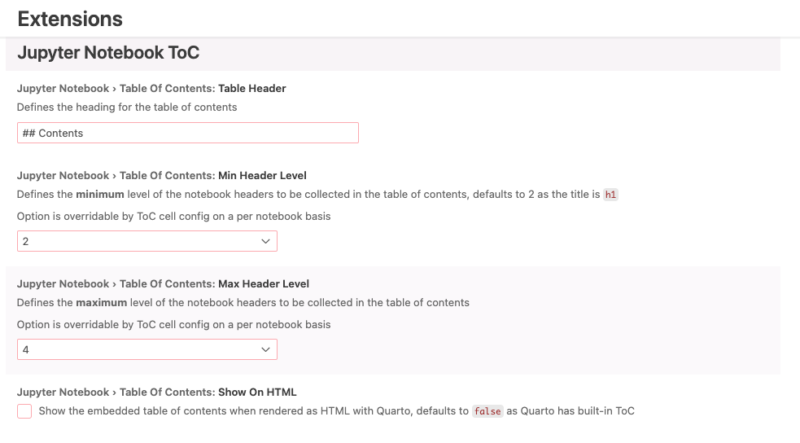

# Simplified table of contents for Jupyter Notebooks

This VS Code extension based off of [xelad0m/vscode-jupyter-toc](https://github.com/xelad0m/vscode-jupyter-toc) is customized for [ValidMind's Jupyter Notebook conventions](https://github.com/validmind/validmind-library/tree/main/notebooks). 

The extension functions more or less the same with the following differences (**tl;dr** our version allows us to add, udpate, and remove ToCs with ease without needing to hack-replace anchor links and manually adjust tables and anchors if the notebooks were ever edited):

<details>
  <summary><b>Version comparison</b></summary>
  
| Original ver. | Simplified ver. | Notes | Reason for fix |
|---|---|---|---|
|   |  | Page anchors set above header instead of inset after markdown heading, no reverse anchors to top in page anchors | Original version was not parsed correctly by Quarto and broke the native ToC, required us to manually find-replace anchor link formatting in each notebook after ToC generation, if notebooks were modified the ToC/anchors would need to be edited manually |
|  || Top/reverse anchor in table of contents cell removed, default heading changed | Required us to hack the default settings to remove the icon-anchor back up to the table of contents |
|  |   | Reduced global settings, defaults set to ValidMind conventions; added a setting for hiding the embedded table of contents cell using [Quarto conditional content](https://quarto.org/docs/authoring/conditional.html) | Required us to adjust the default settings to accommodate for the default structuring of ValidMind Juptyer Notebooks; embedded table of contents cell always rendered by Quarto  |
</details>


## User guide

Refer to the [User guide](/installation/README.md) for installation and usage instructions.

## Updating the extension

### Key files

- **[`src/extension.ts`](src/extension.ts)** — This TypeScript code controls the core functionality of the extension.
- **[`package.json`](package.json)** — This JSON file includes the versioning and the setup for the VS Code global settings display under [`contributes.configuration`](https://code.visualstudio.com/api/references/contribution-points#contributes.configuration). 

### Before you begin

You'll need to install the dependencies required for you to work on the extension for the first time:

```bash
npm install
```

Then install [`@vscode/vsce`](https://github.com/microsoft/vscode-vsce) locally in your project directory in preparation for packaging:

```bash
npm install @vscode/vsce
```

### Update the version

Before you re-package the extension, make sure to bump the version so we can keep track of changes:

```bash
npm version patch
```

### Export the extension

Compile the code:

```bash
npm run compile
```

Since this extension is for internal use and we don't want to publish it to the VS Code marketplace, we'll package the extension and move the exported file into the `installation` directory:

```bash
npx vsce package && mv *.vsix installation
```

