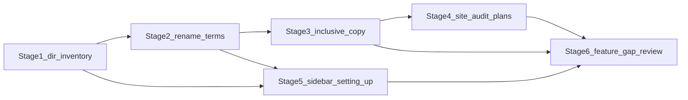

# Inventory documentation refactor (sc-14816)

**Shortcut:** [Documentation - Primary Record Types / Unified AI Governance Inventory](https://app.shortcut.com/validmind/story/14816/documentation-primary-record-types-unified-ai-governance-inventory)

This folder splits the work into **separate stage plans** you can edit, review, or ship independently.

| Stage | Document |
|-------|----------|
| 1 | [stage-01-directory-rename.md](stage-01-directory-rename.md) |
| 2 | [stage-02-filenames-terminology.md](stage-02-filenames-terminology.md) |
| 3 | [stage-03-content-refresh.md](stage-03-content-refresh.md) |
| 4 | [stage-04-sitewide-rename-audit.md](stage-04-sitewide-rename-audit.md) |
| 5 | [stage-05-sidebar-setting-up.md](stage-05-sidebar-setting-up.md) |
| 6 | [stage-06-feature-gap-review.md](stage-06-feature-gap-review.md) |

## Story context

[sc-14816](https://app.shortcut.com/validmind/story/14816/documentation-primary-record-types-unified-ai-governance-inventory) documents primary record types and a unified AI governance inventory (Models, AI Systems, Use Cases, etc.). Stages **1–2** cover mechanics; **3** refreshes inventory guide copy; **4** audits model-centric renames sitewide; **5** adds sidebar/hubs for setup; **6** captures **additional documentation work** implied by the feature but not already covered by those stages.

## Conventions already in the repo

Quarto uses root-anchored HTML aliases (e.g. [`customize-model-inventory-layout.qmd`](../../site/guide/model-inventory/customize-model-inventory-layout.qmd) has `aliases: - /guide/customize-model-inventory-layout.html`). Some pages already have *older* flat aliases (e.g. [`working-with-model-inventory.qmd`](../../site/guide/model-inventory/working-with-model-inventory.qmd) includes `/guide/working-with-model-inventory.html`); new aliases should **merge** with existing ones, not replace them.

## Primary touchpoints today

- **Directory:** [`site/guide/model-inventory/`](../../site/guide/model-inventory/) (standalone `.qmd` files + partials).
- **Guide hub:** [`site/guide/guides.qmd`](../../site/guide/guides.qmd) — listing id `guides-model-inventory`, section "## Model inventory".
- **Global nav:** [`site/_quarto.yml`](../../site/_quarto.yml) — link to `/guide/guides.qmd#model-inventory` labeled "Model inventory".
- **Wide cross-links:** Many references across `site/`. Grep for `guide/model-inventory` and `{{< include /guide/model-inventory/` is the authoritative sweep list.

## Out of scope unless explicitly extended

Product app URLs such as `https://app.prod.validmind.ai/model-inventory` in training slides (routing is app-owned); changing those belongs to a product/URL decision, not only docs.

## Suggested ordering

### Timing notes

- **Stage 5** can start after **Stage 1** (required for `guide/inventory/` paths). Re-run a quick sidebar/path pass after **Stage 2** if filenames change.
- **Stage 6** is best **after Stages 3 and 5** (concepts and IA stabilize), **informed by Stage 4** outputs; can run partially in parallel with late Stage 4 if different owners.
- **Risk:** Stage 2 touches many inbound links; use exhaustive grep and link checking at the checkpoint.
- **Aliases:** Each rename stage should **append** aliases so external bookmarks and Google-indexed URLs keep working.
- **Product alignment:** Stage 3 and the new record-types page (Stage 5) should be validated against the actual platform strings for record types and Settings (screenshots or staging).

## Combined checklist (high level)

- [ ] Stage 1 — Directory rename, path patch, aliases
- [ ] Stage 2 — Inventory file renames, terminology, anchor updates
- [ ] Stage 3 — Inclusive copy on inventory guides
- [ ] Stage 4 — Sitewide rename backlog (draft)
- [ ] Stage 5 — Sidebar INVENTORY, setting-up hub, record-types page
- [ ] Stage 6 — Feature gap backlog (prioritized table)
