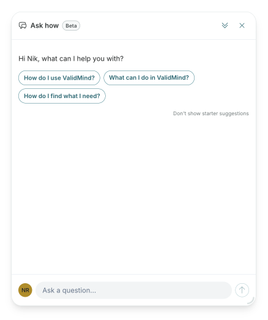

---
# Copyright © 2023-2026 ValidMind Inc. All rights reserved.
# Refer to the LICENSE file in the root of this repository for details.
# SPDX-License-Identifier: AGPL-3.0 AND ValidMind Commercial
title: "Using the documentation"
date: last-modified
---

This documentation site helps you learn , implement it in your organization, govern your AI/ML records (models), and operate the platform day to day.

## How to use this site

Depending on your goal, start in one of these areas:

- **New to ?** Begin with our [quickstarts](/get-started/get-started.qmd) for a guided introduction tailored to your role — developer, validator, or administrator.
- **Looking for step-by-step instructions?** Browse the [Guides](/guide/guides.qmd) for task-based walkthroughs organized by feature area.
- **Ready to integrate programmatically?** Explore the [](/developer/validmind-library.qmd) for code samples, tutorials, and API references.
- **Need hands-on practice?** Visit [](/training/training.qmd) for interactive courses and learning paths.

## Documentation sections

### [About ](/about/overview.qmd)

Introduces the platform, its use cases, and deployment options.

- [About ](/about/overview.qmd) — Platform overview and capabilities
- [AI governance](/about/use-cases/ai-governance.qmd) — EU AI Act compliance and risk classification
- [Model risk management](/about/use-cases/model-risk-management.qmd) — SR 11-7, SS1/23, and E-23 compliance
- [Library and platform](/about/library-and-platform.qmd) — How the  and  work together
- [Deployment options](/about/deployment/deployment-options.qmd) — Multi-tenant cloud vs. Virtual Private 

**Typical tasks:** Understand what  does, evaluate fit for your organization, review compliance use cases.

### [Get started](/get-started/get-started.qmd)

Role-based quickstarts to help you begin using  quickly.

- [Developer quickstart](/get-started/developer/quickstart-developer.qmd) — Set up your environment and document your first record (model)
- [Validator quickstart](/get-started/validator/quickstart-validator.qmd) — Review documentation and prepare validation reports
- [Administrator quickstart](/get-started/administrator/quickstart-administrator.qmd) — Configure users, roles, and organization settings

**Typical tasks:** Complete initial setup, onboard to your role, run through first workflows.

### [Guides](/guide/guides.qmd)

Step-by-step instructions for platform tasks, organized by feature area.

| Section | Intent | Typical tasks |
|---------|--------|---------------|
| [Access](/guide/guides.qmd#access) | Signing up for and logging into  | Register, sign in via SSO, recover access |
| [Configuration](/guide/guides.qmd#configuration) | Setting up your organization and users | Add users, create groups, assign roles and permissions |
| [Integrations](/guide/integrations/managing-integrations.qmd) | Connecting  to external systems | Manage secrets, configure connections, link external records (models) |
| [Workflows](/guide/guides.qmd#workflows) | Automating lifecycle processes | Configure workflow steps, manage transitions, set up approvals |
| [Inventory](/guide/guides.qmd#inventory) | Managing your records (models) and record inventory | Register records, edit fields, configure interdependencies |
| [Documents & templates](/guide/templates/working-with-documents.qmd) | Creating and customizing documentation | Manage document types, customize templates, use the text block library |
| [Documentation](/guide/guides.qmd#documentation) | Authoring and collaborating on documents | Edit content blocks, add test results, manage versions, submit for approval |
| [Validation](/guide/guides.qmd#validation) | Reviewing and validating records (models) | Review documentation, assess compliance, manage findings and artifacts |
| [Reporting](/guide/guides.qmd#reporting) | Analyzing and exporting data | View reports, create custom analytics, export inventory and documents |
| [Monitoring](/guide/guides.qmd#monitoring) | Tracking record (model) performance over time | Enable monitoring, review results, set thresholds and alerts |
| [Attestation](/guide/guides.qmd#attestation) | Managing formal attestations | Create, submit, review, and approve attestations |

### [](/developer/validmind-library.qmd)

Resources for developers integrating  into their workflows.

- [](/developer/validmind-library.qmd) — Python library overview and installation
- [Code samples](/developer/samples-jupyter-notebooks.qmd) — Jupyter notebooks for common use cases
- [Test descriptions](/developer/test-descriptions.qmd) — Reference for available validation tests
- [](/validmind/validmind.qmd) — Python API documentation
- [Public REST API](/reference/validmind-rest-api-vm.qmd) — REST API for platform integrations

**Typical tasks:** Install the library, run tests, log results to the platform, automate documentation.

### [Training](/training/training.qmd)

Hands-on courses and learning paths for .

- [Training overview](/training/training.qmd) — Available courses and videos
- [Learning paths](/training/program/learning-paths.qmd) — Role-based training tracks
- [Sample training plan](/training/program/sample-training-plan.qmd) — Example onboarding schedule

**Typical tasks:** Complete role-based training, gain hands-on platform experience, prepare for certification.

### [Support](/support/support.qmd)

Help resources and troubleshooting.

- [Get help](/support/support.qmd) — Contact support and community resources
- [Troubleshooting](/support/troubleshooting.qmd) — Common issues and solutions
- [FAQ](/faq/faq.qmd) — Frequently asked questions by topic

**Typical tasks:** Resolve errors, find answers to common questions, contact support.

## In-product help

:::: {.column-margin}
{fig-alt="ValidMind in-product chatbot assistant" .screenshot}
::::

The  includes a built-in assistant that answers questions about features and workflows. The documentation you find here is the source of truth for packaged product knowledge — the in-app assistant draws from these pages to provide contextual guidance.

When you need:

- **Quick, contextual answers** — Use the in-app assistant
- **Detailed walkthroughs or reference material** — Search or browse this documentation site

## Where to go next

::: {.attn}

- [Get started](/get-started/get-started.qmd) — Begin with a quickstart for your role
- [Guides](/guide/guides.qmd) — Find step-by-step instructions
- [](/developer/validmind-library.qmd) — Integrate programmatically
- [Support](/support/support.qmd) — Get help when you need it

:::
