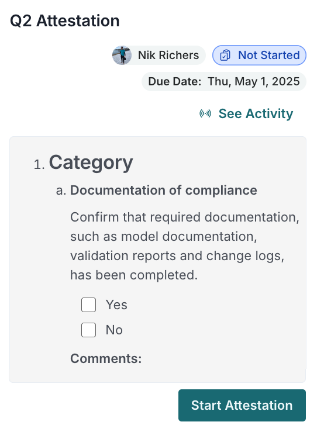

Complete the attestation questionnaire to verify and certify model attributes at a specific point in time. 

As a model owner, this process helps you establish an audit trail of your model’s information, supporting accountability across its lifecycle. Attestation typically includes details about ownership, usage, performance, controls and documentation.
 
::: {.attn}

## Prerequisites

- [x] 
- [x] There are models registered in the inventory that require attestation. [^1]
- [x] Attestation has been set up and an attestation instance is in the [ Not Started]{.bubble} state.[^2]
- [x] You are the model owner or have sufficient permissions to complete attestations.[^3]

:::

## Steps

When prompted on your dashboard:

1. Click **Open Attestations **:

   {fig-alt="Attestation prompt with a link to the attestation labeelled 'Open Attestations'" .screenshot}

   Alternatively, you can access attestations for models that you are the owner of by clicking ** Attestations** in these pages:

   - ** Inventory**
   - ** Findings**

2. In the **Attestations** sidebar on the right, click an active attestation request.

   The view that opens shows you the a model snapshot at the point in time when the attestation was created.

3. Click **Start Attestation**.

4. Document the status change to [** In Progress**]{.bubble} in the [notes]{.smallcaps .b} field and click **Confirm**.

   After you confirm the status change to [** In Progress**]{.bubble}, the attestation questionnaire is ready to be completed.

5. In the right sidebar, complete the attestation questionnaire, including:

   - Checking the applicable boxes
   - Adding relevant comments

6. Click **Submit for Review**.

::: {.column-margin}
{fig-alt="Attestation prompt with a link to the attestation labelled 'Open Attestations'" .screenshot}
:::

7. Document the status change in the [notes]{.smallcaps .b} field for your reviewer and click **Confirm**.

After you confirm the status change, the attestation questionnaire is sent to your reviewer to be completed, typically the validator associated with the model at the time the snapshot for the attestation process was taken.

::: {.callout}
The attestation sidebar is persistent between findings and inventory views, making it easy to reference attestation information while reviewing other model details.
:::

::: {.callout}
If your attestation is rejected, you'll need to revise your responses and resubmit for review. The system maintains a history of all status changes and notes.
:::

<!-- FOOTNOTES -->

[^1]: [Register models in the inventory](/guide/model-inventory/register-models-in-inventory.qmd)

[^2]: [Set up attestations](/guide/attestation/set-up-attestations.qmd)
[^3]: [Manage permissions](/guide/configuration/manage-permissions.qmd) 