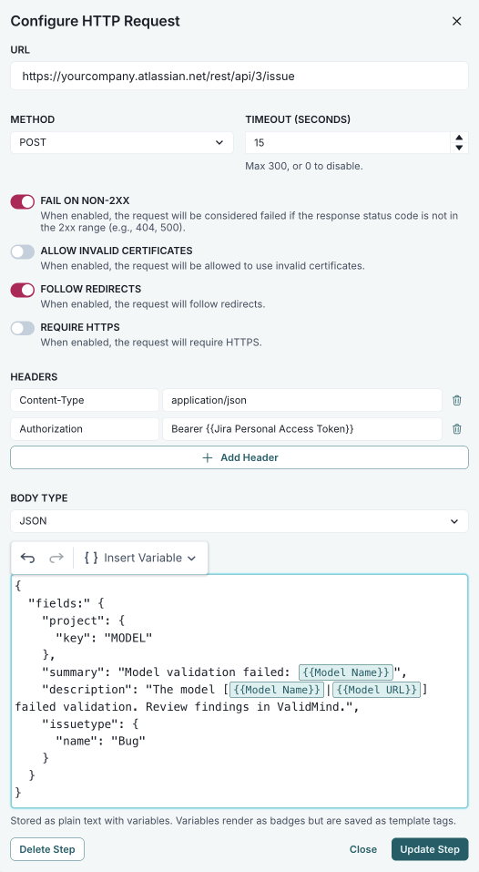
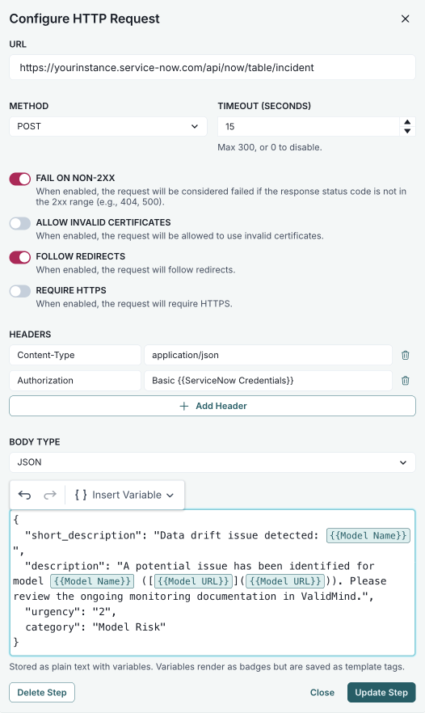

<!-- Copyright © 2023-2026 ValidMind Inc. All rights reserved.
Refer to the LICENSE file in the root of this repository for details.
SPDX-License-Identifier: AGPL-3.0 AND ValidMind Commercial -->

a. Configure the rest of your workflow steps, then drag and drop an **  HTTP Request** step^[[Workflow step types](/guide/workflows/workflow-step-types.qmd#http-request)] onto the canvas and connect it to your workflow.

b. Double-click the step to open the **Configure HTTP Request** modal.

:::: {.content-visible when-format="html" when-meta="includes.jira"}
c. Configure the required fields for Jira,[^configure-jira] replacing the placeholder values with your own:

    - **[url]{.smallcaps}** — `https://yourcompany.atlassian.net/rest/api/3/issue`
    - **[method]{.smallcaps}** — POST
    - **[headers]{.smallcaps}** — Add:
      - `Content-Type`: `application/json`
      - `Authorization`: `Bearer {{Jira Personal Access Token}}`
    
   ::: {.callout title="Use webhook secrets for credentials"}
   Instead of entering credentials in plaintext, use a webhook secret: `Bearer {{secret:jira_pat}}`. To learn more, refer to [Manage secrets](/guide/integrations/manage-secrets.qmd#webhook-secrets).
   :::
    
    - **[body type]{.smallcaps}** — JSON
    - **[body]{.smallcaps}** — Use the following JSON payload:
    
    ```json
    {
      "fields": {
        "project": {
          "key": "MODEL"
        },
        "summary": "Model validation failed: {{Model Name}}",
        "description": "The model [{{Model Name}}|{{Model URL}}] failed validation. Review artifacts in ValidMind.",
        "issuetype": {
          "name": "Bug"
        }
      }
    }
    ```

d. Click **Update Step** to save your configuration.

[^configure-jira]:

    {width=80% fig-alt="Screenshot of the HTTP request step configured to create a Jira ticket, showing the required fields described in step 12." .screenshot}

::::

:::: {.content-visible when-format="html" unless-meta="includes.jira"}
c. Configure the required fields for ServiceNow,[^configure-servicenow] replacing the placeholder values with your own:

    - **[url]{.smallcaps}** — `https://yourinstance.service-now.com/api/now/table/incident`
    - **[method]{.smallcaps}** — POST
    - **[headers]{.smallcaps}** — Add:
      - `Content-Type`: `application/json`
      - `Authorization`: `Basic {{ServiceNow Credentials}}`
    
   ::: {.callout title="Use webhook secrets for credentials"}
   Instead of entering credentials in plaintext, use a webhook secret: `Basic {{secret:servicenow_creds}}`. To learn more, refer to [Manage secrets](/guide/integrations/manage-secrets.qmd#webhook-secrets).
   :::
    
    - **[body type]{.smallcaps}** — JSON
    - **[body]{.smallcaps}** — Use the following JSON payload:

    ```json
    {
      "short_description": "Data drift issue detected: {{Model Name}}",
      "description": "A potential issue has been identified for model {{Model Name}} (link: [{{Model URL}}]({{Model URL}})). Please review the ongoing monitoring documentation in ValidMind.",
      "urgency": "2",
      "category": "Model Risk"
    }
    ```

d. Click **Update Step** to save your configuration.

[^configure-servicenow]:

    {width=80% fig-alt="Screenshot of the HTTP request step configured to create a ServiceNow incident, showing the required fields described in step 12." .screenshot}

::::


