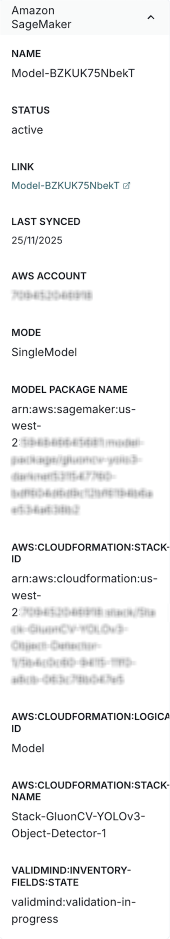

---
# Copyright © 2023-2026 ValidMind Inc. All rights reserved.
# Refer to the LICENSE file in the root of this repository for details.
# SPDX-License-Identifier: AGPL-3.0 AND ValidMind Commercial
title: "Synchronize records with AWS SageMaker"
date: last-modified
---

Synchronize records registered in the  inventory with Amazon Web Services (AWS) SageMaker models.

::: {.attn}

## Prerequisites

- [x] 
- [x] You are a [ Customer Admin]{.bubble} or assigned another role with sufficient permissions to configure connections.[^1]
- [x] You have AWS IAM credentials with permissions to read the SageMaker model registry.

:::

## Configure AWS SageMaker connection

::: {.column-margin}
{width=80% fig-alt="Screenshot of the AWS Sagemaker connection configured to synchronize models, showing the required fields described in step 5." .screenshot}
:::

::: {.column-margin}
{width=60% fig-alt="Screenshot of the model linked to AWS SageMaker, showing the required fields described in step 4." .screenshot}
:::

1. In the left sidebar, click ** Settings**.

2. Under  Integrations, select **Connections**.

3. Click ** Add Connection**.

4. In the modal that opens, select **AWS Sagemaker**.

5. Complete:

   - **[integration name]{.smallcaps}** — How other admins can identify the connection.
   - **[description]{.smallcaps}** (optional) — The intended usage or additional details.
   - **[aws region]{.smallcaps}** - The primary region where your SageMaker model registry lives, for example `us-west-2`.
   - **[aws access key id]{.smallcaps}** — The secret generated by AWS IAM with permissions to read the model registry.
   - **[aws secret access key]{.smallcaps}** — The secret generated by AWS IAM with permissions to read the model registry.
   - **[initial status]{.smallcaps}** — Set to `Operational` to enable immediately or `Disabled` if you plan to finish setup later.

6. Click **Save Integration**. 

7. Test the connection:
  
    a. Hover over the AWS SageMaker connection you just created.
    b. When the **** menu appears, click on it and select ** Test Connection**.

    If the test is successful, the message ** Connection successful** displays.

## Link records to AWS SageMaker

1. In the left sidebar, click ** Inventory**.

2. Select a record or find your record by applying a filter or searching for it.[^2]

3. Scroll down until you locate the **Amazon Sagemaker** connection box in the right sidebar.

4. Hover over the Amazon SageMaker box.

5. When the **** menu appears, click on it and select ** Link Model**.

6. In the modal that opens, click the [select model]{.smallcaps} dropdown to pick the AWS SageMaker model to link.

7. Optional: Click **Test Connection** to ensure the connection is working as expected.

    If the test is successful, the message ** Connection Test Successful** displays.

8. Click **Link Model**.

<!-- FOOTNOTES -->

[^1]: [Manage permissions](../../configuration/manage-permissions.qmd)

[^2]: [Working with the inventory](../../inventory/working-with-the-inventory.qmd#search-filter-and-sort-records)
