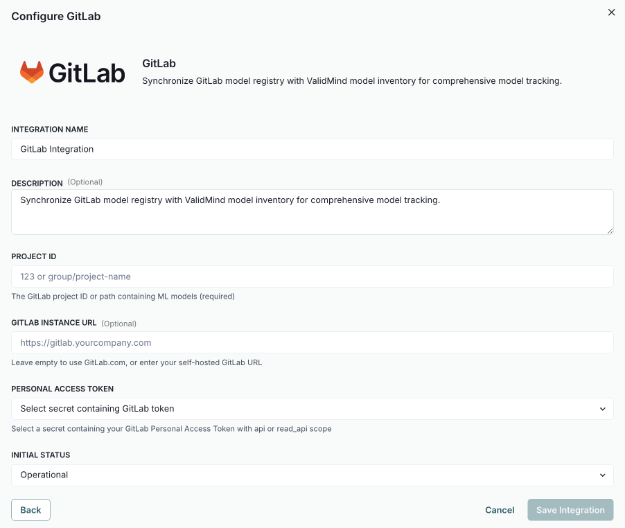

---
# Copyright © 2023-2026 ValidMind Inc. All rights reserved.
# Refer to the LICENSE file in the root of this repository for details.
# SPDX-License-Identifier: AGPL-3.0 AND ValidMind Commercial
title: "Synchronize records with GitLab"
date: last-modified
---

Synchronize your GitLab model registry with the  inventory for comprehensive tracking.

::: {.attn}

## Prerequisites

- [x] 
- [x] You are a [ Customer Admin]{.bubble} or assigned another role with sufficient permissions to configure connections.[^1]
- [x] A secret is configured for your GitLab Personal Access Token with `api` or `read_api` scope.[^2]
- [x] You have access to the GitLab project containing ML models.

:::

## Sync  records with GitLab

::: {.panel-tabset}

### 1. Configure GitLab connection

a. In the left sidebar, click ** Settings**.

b. Under  Integrations, select **Connections**.

c. Click ** Add Connection**.

d. In the modal that opens, select **GitLab**.[^3]

e. Complete:

   - **[integration name]{.smallcaps}** — How other admins can identify the connection.
   - **[description]{.smallcaps}** (optional) — The intended usage or additional details.
   - **[project id]{.smallcaps}** — The GitLab project ID or path containing ML models (required).
   - **[gitlab instance url]{.smallcaps}** (optional) — Leave empty to use GitLab.com, or enter your self-hosted GitLab URL.
   - **[personal access token]{.smallcaps}** — Select a secret containing your GitLab Personal Access Token with `api` or `read_api` scope.
   - **[initial status]{.smallcaps}** — Set to `Operational` to enable immediately or `Disabled` if you plan to finish setup later.

f. Click **Save Integration**.

g. Test the connection:

   i. Hover over the GitLab connection you just created.
   ii. When the  **** menu appears, click on it and select ** Test Connection**.

   If the test is successful, the message ** Connection successful** is displayed.

### 2. Link records to GitLab

a. In the left sidebar, click ** Inventory**.

b. Select a record or find your record by applying a filter or searching for it.[^4]

c. Scroll down until you locate the **GitLab** connection box in the right sidebar.

d. Hover over the GitLab box.

e. When the  **** menu appears, click on it and select ** Link Model**.

f. In the modal that opens, click the [select model]{.smallcaps} dropdown to pick the GitLab model to link.

g. (Optional) Click **Test Connection** to ensure the connection is working as expected.

   If the test is successful, the message ** Connection Test Successful** is displayed.

h. Click **Link Model**.

:::

<!-- FOOTNOTES -->

[^1]: [Manage permissions](/guide/configuration/manage-permissions.qmd)

[^2]: [Manage secrets](/guide/integrations/manage-secrets.qmd)

[^3]:

   {width=80% fig-alt="Screenshot of the Configure GitLab dialog showing fields for integration name, description, project ID, GitLab instance URL, personal access token, and initial status." .screenshot}

[^4]: [Working with the inventory](/guide/inventory/working-with-the-inventory.qmd#search-filter-and-sort-records)
