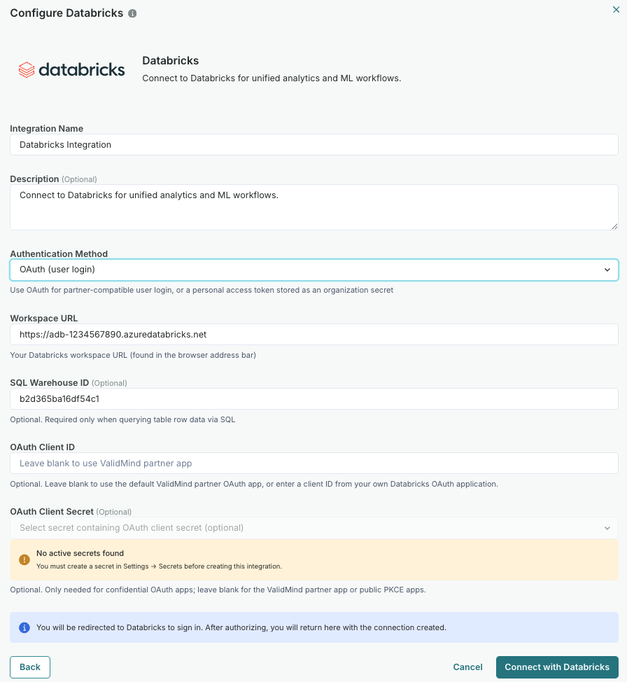

---
# Copyright © 2023-2026 ValidMind Inc. All rights reserved.
# Refer to the LICENSE file in the root of this repository for details.
# SPDX-License-Identifier: AGPL-3.0 AND ValidMind Commercial
title: "Synchronize with Databricks"
date: last-modified
listing:
  - id: whats-next
    type: grid
    grid-columns: 2
    max-description-length: 250
    sort: false
    fields: [title, description]
    contents:
      - path: https://github.com/validmind/validmind-library/blob/main/notebooks/databricks/validmind_databricks_quickstart.ipynb
        title: "Databricks quickstart"
        description: "Install the , load data from a Unity Catalog table via Spark, train a simple classification model, and run ValidMind tests to send results to the ."
---

Link  inventory records to models, datasets, and agents in Databricks Unity Catalog for governance across your ML ecosystem and bidirectional metadata synchronization.

You can also run validation notebooks directly against Databricks-hosted data.

## How does the integration with Databricks work?

Databricks Unity Catalog provides a unified governance solution for all data and AI assets across your Databricks workspaces. The integration exposes three Unity Catalog resource types:

- **Models** — Registered ML models in Unity Catalog's model registry.
- **Datasets** — Tables and datasets managed by Unity Catalog.
- **Agents** — AI agents and applications built on Databricks.

After linking your inventory record to Databricks, you can run validation tests directly against data hosted in Unity Catalog.

```{mermaid}
%%| fig-cap: "Data flow between Databricks and ValidMind"
flowchart LR
    subgraph databricks [Databricks]
        UC[Unity Catalog]
        Data[Tables/Datasets]
    end
    
    subgraph notebook [Validation Notebook]
        SDK[ValidMind SDK]
    end
    
    subgraph validmind [ValidMind Platform]
        Report[Validation Report]
        Inventory[Inventory Record]
    end
    
    UC --> Data
    Data --> SDK
    SDK --> Report
    Report --> Inventory
    Inventory -.->|linked| UC
```


::: {.attn}

## Prerequisites

- [x] 
- [x] You are a [ Customer Admin]{.bubble} or assigned another role with sufficient permissions to configure connections.[^1]
- [x] You have access to your Databricks workspace and can authorize the connection (OAuth) or create a personal access token (PAT).
- [x] For **Personal Access Token** authentication only: a secret is configured for your Databricks PAT.[^2]

:::

## Sync  records with Databricks {#sync-records-with-databricks}

:::: {.panel-tabset}

### 1. Configure Databricks connection

a. In the left sidebar, click ** Settings**.

b. Under  Integrations, select **Connections**.

c. Click ** Add Connection**.

d. In the modal that opens, select **Databricks**.[^3]

e. Complete the shared fields:

   - **Integration Name** — How other admins can identify the connection.
   - **Description** (optional) — The intended usage or additional details.
   - **Authentication Method** — Choose **OAuth (user login)** (recommended) or **Personal Access Token**.
   - **Workspace URL** — Your Databricks workspace URL, found in the browser address bar, such as `https://adb-1234567890.azuredatabricks.net`.
   - **SQL Warehouse ID** (optional) — The ID of your SQL Warehouse, found in SQL Warehouses settings. Required only when querying table row data via SQL.

f. Complete the fields for your authentication method:

   ::: {.panel-tabset}

   ### OAuth (user login)

   - **OAuth Client ID** (optional) — Leave blank to use the default ValidMind partner OAuth app, or enter a client ID from your own Databricks OAuth application.
   - **OAuth Client Secret** (optional) — Select a secret only for confidential OAuth apps. Leave blank for the ValidMind partner app or public PKCE apps.

   Click **Connect with Databricks**. You are redirected to Databricks to sign in and authorize access. After you authorize, you return to Connections with the new connection created. Access and refresh tokens are stored securely and are never shown in the form.

   ### Personal Access Token

   - **Personal Access Token** — Select a secret containing your Databricks Personal Access Token.[^2]
   - **Initial Status** — Set to `Operational` to enable immediately or `Disabled` if you plan to finish setup later.

   Click **Save Integration**.

   :::

g. Test the connection:

   i. Hover over the Databricks connection you just created.
   ii. When the **** menu appears, click on it and select ** Test Connection**.

   If the test is successful, the message ** Connection successful** is displayed.

::: {.callout-note}
## Reconnect OAuth connections

To refresh OAuth tokens later, edit the Databricks connection and click **Reconnect with Databricks**. Complete the Databricks sign-in flow again. Switching an existing connection from Personal Access Token to OAuth also requires reconnecting.
:::

### 2. Link records to Databricks

Once the connection is configured, you can link  inventory records to your Databricks Unity Catalog resources:

a. In the left sidebar, click ** Inventory**.

b. Select a record by clicking on it or find your record by applying a filter or searching for it.[^4]

c. Scroll down until you locate the **Databricks** connection box in the right sidebar.

d. Hover over the Databricks box.

e. When the **** menu appears, click on it and select ** Link Model**.

f. In the modal that opens:

   - **Select Model** — Choose the Databricks model to link from the dropdown.
   - **Sync Frequency** — Set how often ValidMind automatically syncs data from the external system.

g. Click **Link Model** to complete the link.

After linking, metadata from the Unity Catalog resource syncs to . You can use linked fields in custom calculated fields to surface Databricks metadata directly in your inventory views.

::::

## What's next

:::{#whats-next}
:::


<!-- FOOTNOTES -->

[^1]: [Manage permissions](/guide/configuration/manage-permissions.qmd)

[^2]: [Manage secrets](/guide/integrations/manage-secrets.qmd)

[^3]:

  {width=80% fig-alt="Screenshot of the Configure Databricks connection dialog with Authentication Method set to OAuth (user login), showing Workspace URL, optional SQL Warehouse ID, optional OAuth Client ID and Client Secret, and the Connect with Databricks button." .screenshot}

[^4]: [Working with the inventory](/guide/inventory/working-with-the-inventory.qmd#search-filter-and-sort-records)
