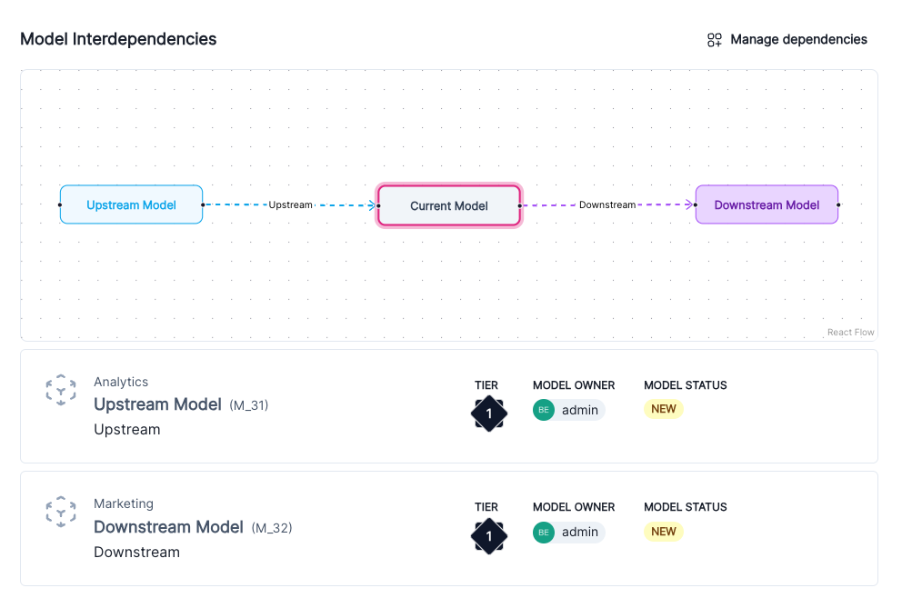
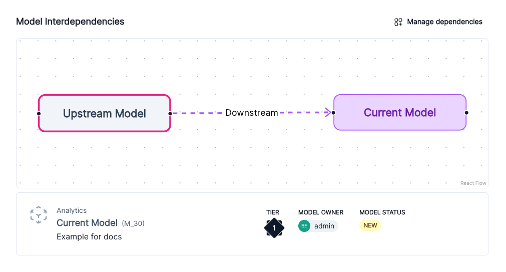
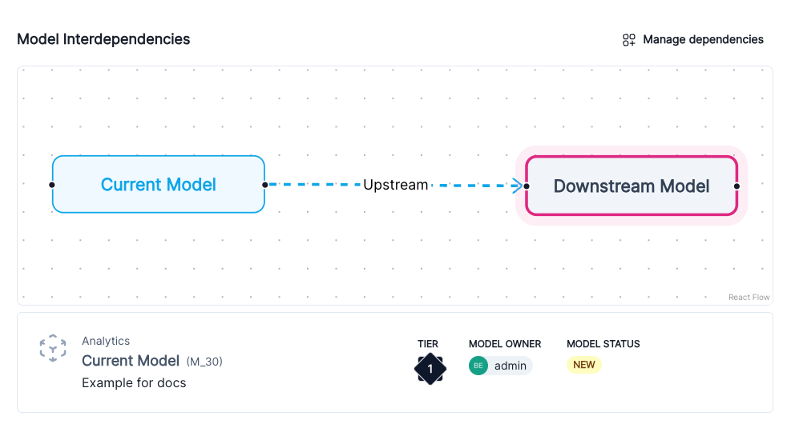

---
# Copyright © 2023-2026 ValidMind Inc. All rights reserved.
# Refer to the LICENSE file in the root of this repository for details.
# SPDX-License-Identifier: AGPL-3.0 AND ValidMind Commercial
title: "Configure record interdependencies"
date: last-modified
aliases:
  - /guide/model-inventory/configure-model-interdependencies.html
  - /guide/inventory/configure-model-interdependencies.html
---

Link two or more records in your  inventory together. Dependencies are useful to understand how a record is
affected by or affects other records in your inventory.

::: {.attn}

## Prerequisites

- [x] 
- [x] There are two or more records registered in the inventory.[^1]
- [x] You are the model owner[^2] for the record you want to set interdependencies for, a [ Developer]{.bubble}, or assigned another role with sufficient permissions to perform the tasks in this guide.[^3]

:::

## View interdependencies

1. In the left sidebar, click ** Inventory**.

2. Under the [record type]{.smallcaps} drop-down, select the type of record you want view interdependencies for.[^4]

3. Select a record or find your record by applying a filter or searching for it.[^5]

4. Any existing record interdependencies are shown under the **Interdependencies** section.

    On the interactive flowchart, the currently viewed record is highlighted:

    - Click and drag to change what area is displayed on the flowchart.
    - To zoom in and out, use your mouse scroll button or zoom trackpad gesture.

    {fig-alt="A screenshot showing example record interdependencies" .screenshot}

## Edit interdependencies

1. In the left sidebar, click ** Inventory**.

2. Under the [record type]{.smallcaps} drop-down, select the type of record you want edit interdependencies for.[^6]

3. Select a record or find your record by applying a filter or searching for it.[^7]

4. Click ** Manage Dependencies** to open up the interdependencies detail menu.

5. Select either the ** Upstream** or ** Downstream** tab:

    - **Upstream** — Provides input or intermediate results to another record.
    - **Downstream** — Receives input and typically performs further processing, predictions, or actions based on that input.

    You can swap between the ** Upstream** or ** Downstream** tabs to set both interdependency types at once.

6. On your list of related records from the inventory, add or remove interdependencies as desired:

    - **Add** — Check off any records that are either upstream or downstream dependent on the current record.
    - **Remove** — Uncheck any records previously linked as upstream or downstream dependent on the current record.

7. Click **Save** to apply your changes.

Once applied, interdependencies will populate on all linked records.

:::: {.flex .flex-wrap .justify-around}

::: {.w-40-ns}

{fig-alt="A screenshot showing the Upstream Model linked to the downstream Current Model" .screenshot group="interdependency"}

:::

::: {.w-40-ns}

{fig-alt="A screenshot showing the Downstream Model linked to the upstream Current Model" .screenshot group="interdependency"}

:::

::::

<!-- FOOTNOTES -->

[^1]: [Register records in the inventory](register-records-in-inventory.qmd)

[^2]: [Manage model stakeholders](/guide/inventory/edit-inventory-fields.qmd#manage-model-stakeholders)

[^3]: [Manage permissions](/guide/configuration/manage-permissions.qmd)

[^4]: [Manage inventory record types](manage-inventory-record-types.qmd)

[^5]: [Working with the inventory](/guide/inventory/working-with-the-inventory.qmd#search-filter-and-sort-records)

[^6]: [Manage inventory record types](manage-inventory-record-types.qmd)

[^7]: [Working with the inventory](/guide/inventory/working-with-the-inventory.qmd#search-filter-and-sort-records)
