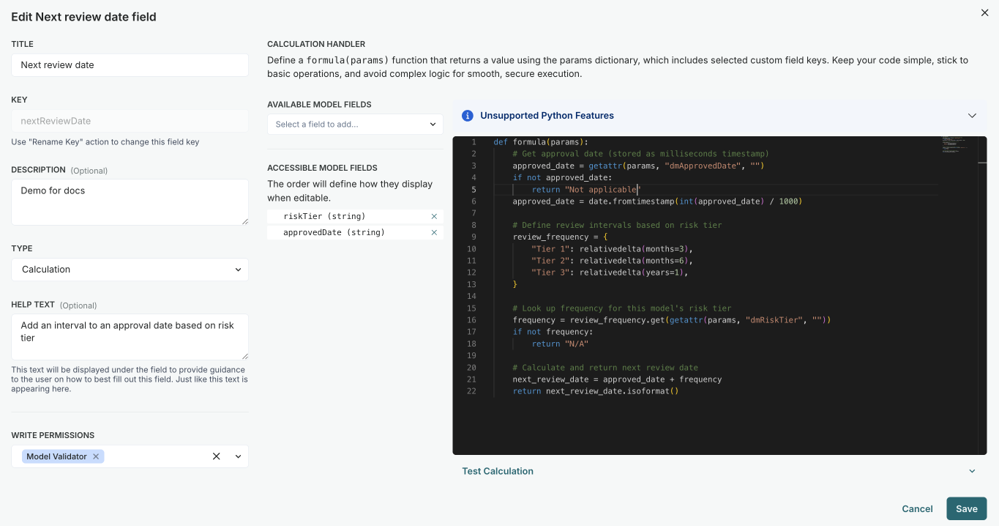
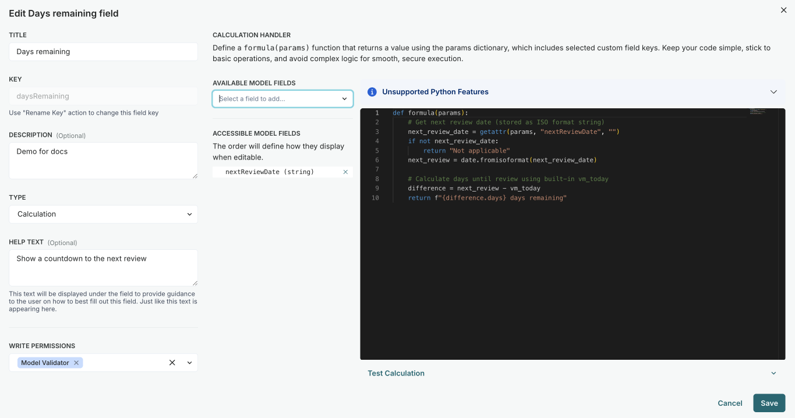

<!-- Copyright © 2023-2026 ValidMind Inc. All rights reserved.
Refer to the LICENSE file in the root of this repository for details.
SPDX-License-Identifier: AGPL-3.0 AND ValidMind Commercial -->

:::: {.content-visible unless-format="revealjs"}

::: {.callout-button .pl4 .nt2}
::: {.callout collapse="true" appearance="minimal"}

### Example — Next review date & days remaining

Combining different inventory field types provides a flexible way to automatically track model review schedules. This example creates fields that calculate the next review date based on approval date and validation frequency, adjusted by risk tier, and then computes the days remaining until that review.

Common date and time field types available in your formulas include:

- `vm_today` — Today's date (updates each time the formula runs)
- `date` — Python's `datetime.date` class
- `datetime` — Python's `datetime.datetime` class
- `timedelta` — Duration in days, seconds, or microseconds
- `relativedelta` — Duration in months, years, etc. (from `dateutil`)

Here, we show you how to use `date`, `relativedelta`, and `vm_today`.

#### Calculate the next review date

Determine the next review date based on an approval date and a frequency of validation that adjusts based on the risk tier:

1. Create an `Approved Date` date field.

2. Create a `Frequency of Validation` string field with the following options:

  - Weekly
  - Monthly
  - Yearly

3. Create a `Risk Tier` calculation field that depends on the frequency of validation:
   
   ```python
   def formula(params):
       if params.frequencyOfValidation == "Weekly":
           return "Tier 1"
       elif params.frequencyOfValidation == "Monthly":
           return "Tier 2"
       elif params.frequencyOfValidation == "Yearly":
           return "Tier 3"
       else:
           return "N/A"
   ```

4. Create a `Next Review Date` calculation field that depends on the approved date and risk tier:

   ```python
   def formula(params):
       """
       Calculate the next review date based on the approval date and review frequency.
   
       Args:
           params.dmApprovedDate (str): The approval date in 'YYYY-MM-DD' format.
           params.dmRiskTier (string): The review tier (Tier 1, Tier 2, or Tier 3).
   
       Returns:
           datetime: The next review date.
       """
       # Guard against empty dates
       if params.dmApprovedDate == "":
           return "N/A"
   
       # Convert the approved_on date string to a datetime object
       approved_date = date.fromtimestamp((int(params.dmApprovedDate))/1000)
   
       # Define the review frequency mapping
       review_frequency = {
           "Tier 1": relativedelta(months=3),  # Quarterly
           "Tier 2": relativedelta(months=6),  # Semi-annually
           "Tier 3": relativedelta(years=1),   # Annually
       }
   
       # Get the appropriate time delta based on the tier
       frequency = review_frequency.get(params.dmRiskTier)
       if not frequency:
           # "Invalid tier. Must be Tier 1, Tier 2, or Tier 3."
           return "N/A"
   
       # Calculate the next review date
       next_review_date = approved_date + frequency
       return next_review_date.isoformat()
   ```

{fig-alt="A screenshot showing the screen for adding a calculation type field that automatically calculates the next review date" width=90% .screenshot}

You can now determine the next review date in workflows by making a workflow depend on `Approved Date`. To test, change the `Approved Date` after the fact and see how `Next Review Date` changes.

#### Calculate the days remaining until the next review

1. Create a `Days Remaining` calculation field that depends on the `Next Review Date` field:

   ```python
   def formula(params):
       """
       Calculate days remaining until the next review.
   
       Args:
           params.nextReviewDate (str): The next review date in ISO format.
   
       Returns:
           str: Days remaining until review (example:"45 days remaining").
       """
       # Get next review date (stored as ISO format string)
       next_review_date = getattr(params, "nextReviewDate", "")
       if not next_review_date:
           return "Not applicable"
       next_review = date.fromisoformat(next_review_date)
       
       # Calculate days until review using built-in vm_today
       difference = next_review - vm_today
       return f"{difference.days} days remaining"
   ```


{fig-alt="A screenshot showing the screen for adding a calculation type field that automatically calculates the days remaining until the next review" width=90% .screenshot}

You can now check the number of days remaining until the next review.
:::
:::

::::
