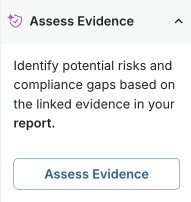

---
# Copyright © 2023-2026 ValidMind Inc. All rights reserved.
# Refer to the LICENSE file in the root of this repository for details.
# SPDX-License-Identifier: AGPL-3.0 AND ValidMind Commercial
title: "Map and assess evidence"
date: last-modified
listing:
  - id: whats-next
    type: grid
    grid-columns: 2
    max-description-length: 250
    sort: false
    fields: [title, description]
    contents:
      - /guide/model-validation/assess-compliance.qmd
---

Use AI-assisted tools to map relevant evidence to validation guidelines and generate compliance assessments based on linked evidence. These features streamline the validation workflow by reducing manual effort while maintaining quality.

::: {.attn}

## Prerequisites

- [x] 
- [x] The model you are validating is registered in the model inventory.[^1]
- [x] A model developer has submitted their model documentation for validation.[^2]
- [x] You are a [ Validator]{.bubble} or assigned another role with sufficient permissions.[^3]

:::

## How do evidence mapping and assessment work?

Validation reports require you to link supporting evidence to each guideline and write compliance assessments, a process that can be time-consuming when done manually across dozens of guidelines.

Map evidence
: Scans all available evidence from developers and validators, then suggests which items are relevant to each guideline. Instead of searching through evidence blocks yourself, you review AI-suggested matches and approve the ones that apply. Each suggestion includes a relevance score and explanation so you can make informed decisions.

Assess evidence
: Analyzes the linked evidence for a guideline and drafts a structured compliance assessment. The generated assessment includes a compliance conclusion, specific observations about gaps or issues, and a technical review of what the evidence demonstrates. You review the draft, make any edits, and approve it — saving time while maintaining control over the final content.

Both features are designed to accelerate validation without replacing your judgment. You always review and approve suggestions before they become part of the report.

## Map evidence to guidelines

:::: {.column-margin}
{fig-alt="Map Evidence panel showing evidence type toggles for Developer Evidence and Validator Evidence, and a Relevance Threshold slider set to 0.7." .screenshot}
::::

Map Evidence uses AI to suggest relevant evidence for each validation guideline, helping you find and link supporting documentation from both developers and validators.

1. In the left sidebar, click ** Inventory**.

2. Select the model you are validating.[^4]

3. In the left sidebar, click ** Documents** and select the **Latest** tab.

4. Click on a validation report.

5. Navigate to a section and expand the **Evidence** panel.

6. Click ** Map Evidence**.

7. Configure the mapping options:
   - Toggle **Developer Evidence** to include evidence logged via the .
   - Toggle **Validator Evidence** to include evidence uploaded or created by validators.
   - Adjust the **Relevance Threshold** slider — lower values return more results while higher values show only the most relevant matches.

8. Click **Map Evidence** to run the AI mapping.

   The panel displays how many evidence items are available to review for each guideline in the section.

### Review and approve mapped evidence

After running Map Evidence, you can review and approve suggestions at two levels:

**From the report overview:**

1. Navigate to the validation report **Overview** page.

2. In the right sidebar, the **Map Evidence** panel shows how many items need review across the entire report.

3. Use **Approve All** to link all suggested evidence across all guidelines, or **Reject All** to dismiss all suggestions.

**From individual guidelines:**

1. Navigate to a specific section in the validation report.

2. Expand the **Evidence** panel for a guideline.

3. Click ** Map Evidence** to open the mapping panel for that guideline.

4. Review individual evidence suggestions:

   - Each item shows the evidence block name and a relevance score.
   - Click **See Relevance Analysis** to view why the evidence was suggested.
   - Click **Approve** to link an individual item to the guideline.
   - Click **Reject** to dismiss an individual suggestion.

5. Or use **Approve All** / **Reject All** to handle all suggestions for that guideline at once.

Approved evidence appears in the Evidence panel for that guideline, organized by evidence type (Developer Evidence or Validator Evidence).

## Assess evidence for compliance

:::: {.column-margin}
{fig-alt="Assess Evidence panel showing option to identify potential risks and compliance gaps based on linked evidence." .screenshot}
::::

Assess Evidence analyzes the linked evidence and generates a structured compliance assessment, identifying potential risks and compliance gaps.

1. Navigate to a section that has linked evidence.

2. Expand the **Evidence** panel.

3. Click ** Assess Evidence**.

4. The AI analyzes the linked evidence and generates an **Evidence Assessment** containing:

   - **Guideline Assessment** — A compliance conclusion indicating whether the guideline requirements are fully met, partially met, or not met, with an explanation of the evidence quality.
   
   - **Validation Observations** — Specific findings about gaps or issues in the evidence, with each observation covering a single concern and suggesting actions for developers.
   
   - **Evidence Review** — A detailed analysis of what the evidence demonstrates, including references to specific test outputs, documentation, and any limitations.

   The panel displays how many assessments are available to review.

### Review and approve evidence assessments

After running Assess Evidence, you can review and approve assessments at two levels:

**From the report overview:**

1. Navigate to the validation report **Overview** page.

2. In the right sidebar, the **Assess Evidence** panel shows how many assessments need review across the entire report.

3. Use **Approve All** to accept all generated assessments, or **Reject All** to dismiss all assessments.

**From individual guidelines:**

1. Navigate to a specific section in the validation report.

2. Expand the **Evidence Assessment** panel for a guideline. Assessments pending review show a [Review]{.bubble} status.

3. Review the generated assessment content.

4. Click **Approve** to accept the assessment, or **Reject** to dismiss it.

5. After approving, you can edit the assessment content as needed — changes are auto-saved.

6. To regenerate an assessment, click ** Reassess Evidence** to run the AI analysis again with any updated evidence.

## What's next

:::{#whats-next}
:::

<!-- FOOTNOTES -->

[^1]: [Register records in the inventory](/guide/inventory/register-records-in-inventory.qmd)

[^2]: [Submit for approval](/guide/model-documentation/submit-for-approval.qmd)

[^3]: [Manage permissions](/guide/configuration/manage-permissions.qmd)

[^4]: [Working with the inventory](/guide/inventory/working-with-the-inventory.qmd#search-filter-and-sort-records)
