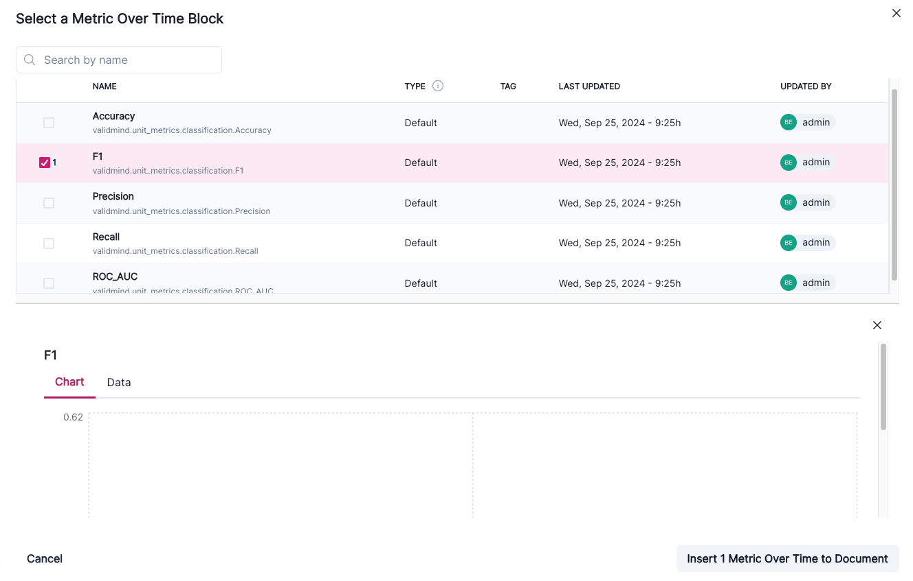
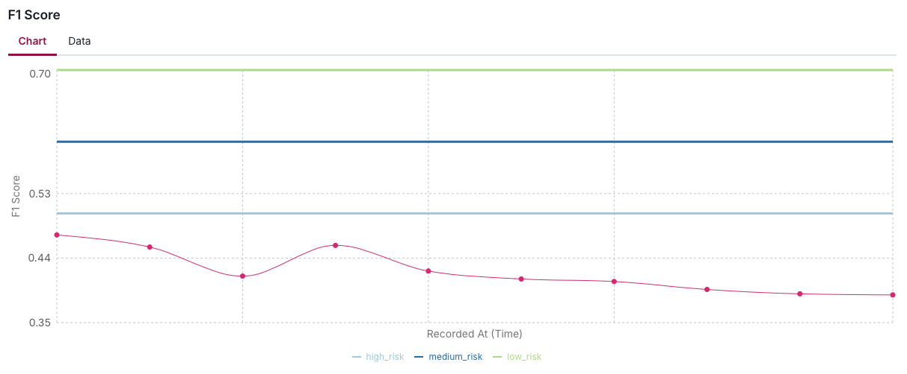
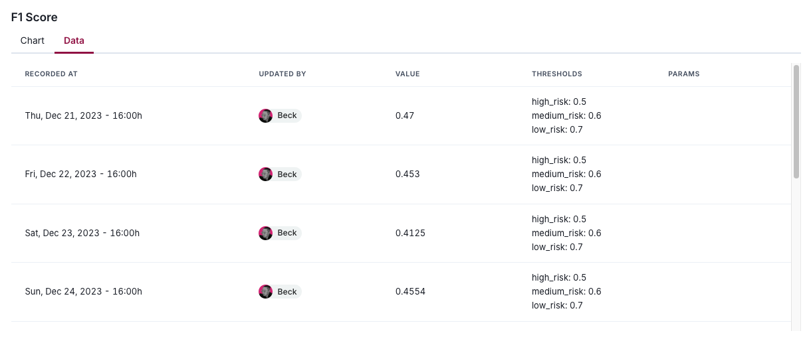

---
# Copyright © 2023-2026 ValidMind Inc. All rights reserved.
# Refer to the LICENSE file in the root of this repository for details.
# SPDX-License-Identifier: AGPL-3.0 AND ValidMind Commercial
title: "Work with metrics over time"
date: last-modified
---

Once generated via the , view and add metrics over time to your ongoing monitoring reports in the .

Metrics over time refers to the continued monitoring of a model's performance once it is deployed. Tracking how a model performs as new data is introduced or conditions change ensures that it remains accurate and reliable in real-world environments where data distributions or market conditions shift.

- Model performance is determined by continuously measuring metrics and comparing them over time to detect degradation, bias, or shifts in the model's output.
- Performance data is collected and tracked over time, often using a rolling window approach or real-time monitoring tools with the same metrics used in testing, but observed across different periods.
- Continuous tracking helps to identify if and when a model needs to be recalibrated, retrained, or even replaced due to performance deterioration or changing conditions.

::: {.column-margin}
::: {.callout}
## **[Log metrics over time ](/notebooks/how_to/metrics/log_metrics_over_time.ipynb)**

Learn how to log metrics over time, set thresholds, and analyze model performance trends with our Jupyter Notebook sample.
:::

:::

::: {.attn}

## Prerequisites

- [x] 
- [x] The model you want to log metrics over time for is registered in the inventory.[^1]
- [x] Metrics over time have already been logged via the  for your model.[^2]
- [x] You are a [ Developer]{.bubble} or assigned another role with sufficient permissions to perform the tasks in this guide.[^3]

:::

## Add metrics over time

1. In the left sidebar, click ** Inventory**.

2. Select a model or find your model by applying a filter or searching for it.[^4]

3. In the left sidebar that appears for your model, click ** Documents** and select the **Latest** tab.[^5]

4. Select a Monitoring document type file.[^6]

5. Click on a section header to expand that section and add content.

6. Hover your mouse over the space where you want your new block to go until a horizontal line with a  sign appears that indicates you can insert a new block:

    {fig-alt="A gif showing the process of adding a content block in the UI" .screenshot}

7.  Click  and then select **Metric Over Time**[^7] under [from library]{.smallcaps}.

8. Select metric over time results:

   - Choose from available **VM Library** (out-of-the-box) or **Custom** tests under [metric over time]{.smallcaps} in the left sidebar of the test selection modal.
   - Use ** Search by name** on the top-left to locate specific metric results.

    {fig-alt="A screenshot showing several Metric Over Time blocks that have been selected for insertion" .screenshot group="time-metric"}

   To preview what is included in a metric, click on it. By default, the actively selected metric is previewed.

9. Click **Insert # Metric(s) Over Time to Document** when you are ready.

10. After inserting the metrics into your document, review the data to confirm that it is accurate and relevant.

    {fig-alt="A screenshot showing an example F1 Score — Metric Over Time visualization" .screenshot group="time-metric"}

## View metric over time metadata

After you have added metrics over time to your document, you can view the following information attached to the result:

- Date and time the metric was recorded
- Who updated the metric
- The numeric value of the metric
- The metric's thresholds
- Any additional parameters

1. In the left sidebar, click ** Inventory**.

2. Select a model or find your model by applying a filter or searching for it.[^8]

3. In the left sidebar that appears for your model, click ** Documents** and select the **Latest** tab.[^9]

4. Select a Monitoring document type file.[^10]

5. Locate the metric whose metadata you want to view.

6. Under the metric's name, click on **Data** tab.

    {fig-alt="A screenshot showing an example Data tab within a Metric Over Time" .screenshot}

<!-- FOOTNOTES -->

[^1]: [Register models in the inventory](/guide/model-inventory/register-models-in-inventory.qmd)

[^2]: [Log metrics over time](/notebooks/how_to/metrics/log_metrics_over_time.ipynb)

[^3]: [Manage permissions](/guide/configuration/manage-permissions.qmd)

[^4]: [Working with the model inventory](/guide/model-inventory/working-with-model-inventory.qmd#search-filter-and-sort-models)

[^5]: [Work with document versions](/guide/model-documentation/work-with-document-versions.qmd)

[^6]: [Working with model documents](/guide/templates/working-with-model-documents.qmd)

[^7]: [Work with content blocks](/guide/model-documentation/work-with-content-blocks.qmd)

[^8]: [Working with the model inventory](/guide/model-inventory/working-with-model-inventory.qmd#search-filter-and-sort-models)

[^9]: [Work with document versions](/guide/model-documentation/work-with-document-versions.qmd)

[^10]: [Working with model documents](/guide/templates/working-with-model-documents.qmd)