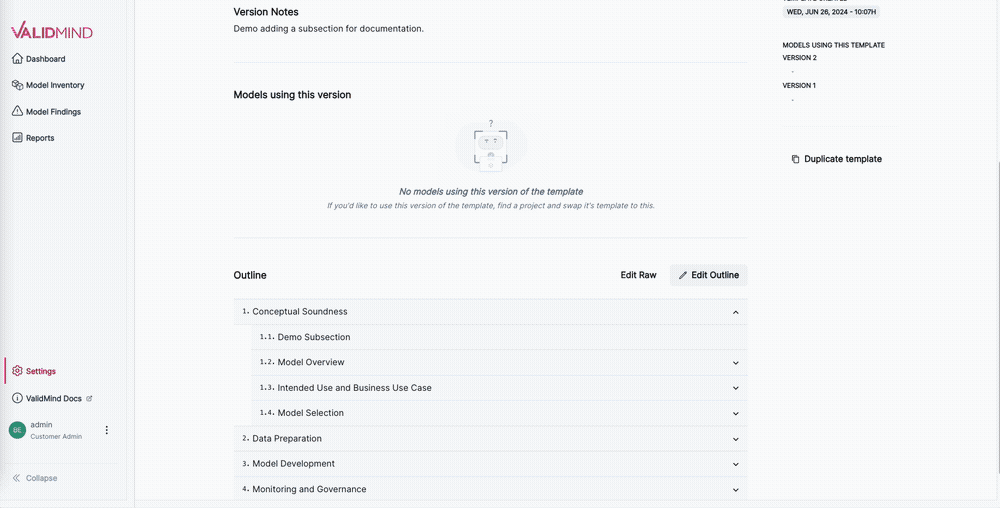

---
# Copyright © 2023-2026 ValidMind Inc. All rights reserved.
# Refer to the LICENSE file in the root of this repository for details.
# SPDX-License-Identifier: AGPL-3.0 AND ValidMind Commercial
title: "Customize document templates"
date: last-modified
aliases:
  - /guide/customize-documentation-templates.html
  - /guide/documentation/customize-documentation-templates.html
  - /guide/templates/customize-documentation-templates.html
includes:
    customize: true
---

Edit templates for document types to fit your specific case-by-case needs, such as type or complexity of record or record use case.

  - Templates are versioned and saving a template after making changes or reverting to a previous version state always creates a new version, or you can duplicate templates to create new independent templates in your library.
  - Document templates are stored as YAML files edited directly using the advanced editor, allowing you full control over the minitua such as desired guidelines.
  - We also provide a simplified editing experience to allow you to easily construct and rearrange the outline of your template.

::: {.attn}

## Prerequisites

- [x] 
- [x] The template you want to edit must exist in the .[^1]
- [x] You are a [ Customer Admin]{.bubble} or assigned another role with sufficient permissions to perform the tasks in this guide.[^2]

::: {.callout title="Not sure which template or which version of a template your document is using?"}
Check the **Document Template** section[^3] in the right sidebar.
:::

:::

## Edit template outlines

### Using the template editor



### Using the YAML editor

1. In the left sidebar, click ** Settings**.

2.  Under  Documents, select **Templates**.

3. Select one of the tabs for the type of template you want to edit:[^4]

   - **Development**
   - **Validation**
   - **Monitoring**
   - **Custom**

4. Click the template to edit and on the template details page, select ** Edit Raw**. 

5. In the Edit Template YAML editor that opens, make your changes according to the template schema,[^5] including the addition of any shared text blocks from your library.[^6]

6. Once you're finished editing, click **Continue** to view a side-by-side comparison of your changes with the previous version of the template.

7. On the Review Changes screen:
   - Add a description in **Version Notes** to track your changes.
   - Click **Save Version #** to save the new version.

{fig-alt="A gif demonstrating editing the raw YAML behind a template" .screenshot width=90%}

Once saved, your new template version becomes available for use.

#### Template schema

::: {.column-page-inset-right}



:::

#### Troubleshooting YAML templates

The document template editor validates the YAML changes you make and flags any errors that it finds. If you make a change that the editor cannot parse correctly, the editor will not let you save the changes until you correct the YAML.

Common issues with YAML include incorrect indenting, imbalanced quotes, or missing colons between keys and values. If you run into issues with incorrect YAML, check the error message provided by the template editor, as it might provide a line and column number where the error occurs.

## Configure assessment options[^7]

::: {.callout}



[Configure assessment options](/guide/validation/configure-assessment-options.qmd){.button}
:::


## Add text blocks to templates

Add shared text blocks from your library[^8] to your templates through both the template outline or the YAML editor.

### Add text blocks via template outlines



### Add text blocks via the YAML editor

To add shared text blocks to your templates via the YAML editor:

::: {.panel-tabset}

#### 1. Retrieve keys for shared blocks

a. In the left sidebar, click ** Settings**.

b.  Under  Documents, select **Block Library**.

c. Select **Shared Blocks** and click **** under the right-most column for the block you'd like to insert into a template.

d. Select ** Edit Details** and review the details for that block.

e. To the right of the **Key**, click **** to copy the key to your clipboard.

#### 2. Insert block keys into YAML templates

a. With your shared text block's key copied to your clipboard, open up the editor for a YAML template.[^9]

b. Under a section or subsection's `contents` block sequence,[^10] insert a sequence item of `content_type: text` with your `block_key` nested under `options`.

    For example:

      ```yaml
      - id: section
        title: Section
        contents:
          - content_id: shared_block2
            content_type: text
            options:
              block_key: cmg5jb7tw000rgraxmxsavxez
      - id: parent_section
        title: Parent Section
        sections:
          - id: subsection
            title: Subsection
            parent_section: parent_section
            contents:
              - content_id: shared_block1
                content_type: text
                options:
                  block_key: cmg5m1vru0000ibaxa34pl0wp
      ```

c. Finish editing your template, then save a new version.

:::

<!-- FOOTNOTES -->

[^1]: [Manage document templates](manage-document-template-library.qmd)

[^2]: [Manage permissions](/guide/configuration/manage-permissions.qmd)

[^3]: [Manage document templates](manage-document-template-library.qmd#swap-document-templates)

[^4]: [Managing documents](/guide/templates/managing-documents.qmd)

[^5]: [Template schema](#template-schema)

[^6]: [Add text blocks to templates](#add-text-blocks-to-templates)

[^7]: [validation report templates only]{.smallcaps .pink}

[^8]: [Manage text block library](manage-text-block-library.qmd)

[^9]: [Using the YAML editor](#using-the-yaml-editor)

[^10]: [Template schema](#template-schema)
