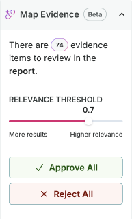

<!-- Copyright © 2023-2026 ValidMind Inc. All rights reserved.
Refer to the LICENSE file in the root of this repository for details.
SPDX-License-Identifier: AGPL-3.0 AND ValidMind Commercial -->

:::: {.content-visible unless-format="revealjs"}
## Map evidence to guidelines

:::: {.column-margin}
{fig-alt="Map Evidence panel showing evidence type toggles for Developer Evidence and Validator Evidence, and a Relevance Threshold slider set to 0.7." .screenshot}
::::

Map Evidence uses AI to suggest relevant evidence for each validation guideline, helping you find and link supporting documentation from both developers and validators.

1. In the left sidebar, click ** Inventory**.

2. Select a record or find your record by applying a filter or searching for it.^[[Working with the inventory](/guide/inventory/working-with-the-inventory.qmd#search-filter-and-sort-records)]

3. In the left sidebar that appears for your record, click ** Documents** and select the **Latest** tab.^[[Work with document versions](/guide/documentation/work-with-document-versions.qmd)]

4. Click on a Validation type file.^[[Preparing validation reports](/guide/validation/preparing-validation-reports.qmd#validation-overview)]

5. Navigate to a section and expand the **Evidence** panel.

6. Click ** Map Evidence**.

7. Configure the mapping options:
   - Toggle **Developer Evidence** to include evidence logged via the .
   - Toggle **Validator Evidence** to include evidence uploaded or created by validators.
   - Adjust the **Relevance Threshold** slider — lower values return more results while higher values show only the most relevant matches.

8. Click **Map Evidence** to run the AI mapping.

   The panel displays how many evidence items are available to review for each guideline in the section.

### Review and approve mapped evidence

After running Map Evidence, you can review and approve suggestions at three levels:

::: {.panel-tabset}

#### For the entire report

1. Open the validation report and look at the right sidebar.

2. The **Map Evidence** panel shows how many items need review across the entire report.

3. Use **Approve All** to link all suggested evidence across all guidelines, or **Reject All** to dismiss all suggestions.

4. To re-run mapping with different settings, click **Remap Evidence**. This lets you adjust the relevance threshold or change which evidence types to include, then generate new suggestions.

#### For an entire section

1. Navigate to a specific section in the validation report.

2. In the section header, click ** Map Evidence** to open the mapping panel.

3. Use **Approve All** to link all suggested evidence for guidelines in that section, or **Reject All** to dismiss all section suggestions.

4. To re-run mapping with different settings, click **Remap Evidence**.

#### For individual guidelines

1. Navigate to a specific section in the validation report.

2. Expand the **Evidence** panel for a guideline.

3. Click ** Map Evidence** to open the mapping panel for that guideline.

4. Review individual evidence suggestions:

   - Each item shows the evidence block name and a relevance score.
   - Click **See Relevance Analysis** to view why the evidence was suggested.
   - Click **Approve** to link an individual item to the guideline.
   - Click **Reject** to dismiss an individual suggestion.

5. Or use **Approve All** / **Reject All** to handle all suggestions for that guideline at once.

Approved evidence appears in the Evidence panel for that guideline, organized by evidence type (Developer Evidence or Validator Evidence).

:::

::::

:::: {.content-hidden unless-format="revealjs"}
Map Evidence uses AI to suggest relevant evidence for each validation guideline, helping you find and link supporting documentation from both developers and validators.

1. In the left sidebar, click ** Inventory**.

2. Select a record or find your record by [applying a filter or searching for it](/guide/inventory/working-with-the-inventory.qmd#search-filter-and-sort-records){target="_blank"}.

3. In the left sidebar that appears for your record, click **Validation** under ** Documents**.

4. Navigate to a section and expand the **Evidence** panel.

5. Click ** Map Evidence**.

6. Configure the mapping options:
   - Toggle **Developer Evidence** to include evidence logged via the .
   - Toggle **Validator Evidence** to include evidence uploaded or created by validators.
   - Adjust the **Relevance Threshold** slider — lower values return more results while higher values show only the most relevant matches.

7. Click **Map Evidence** to run the AI mapping.

   The panel displays how many evidence items are available to review for each guideline in the section.

### Review and approve mapped evidence

After running Map Evidence, you can review and approve suggestions at three levels:

#### For the entire report

1. Open the validation report and look at the right sidebar.

2. The **Map Evidence** panel shows how many items need review across the entire report.

3. Use **Approve All** to link all suggested evidence across all guidelines, or **Reject All** to dismiss all suggestions.

4. To re-run mapping with different settings, click **Remap Evidence**. This lets you adjust the relevance threshold or change which evidence types to include, then generate new suggestions.

#### For an entire section

1. Navigate to a specific section in the validation report.

2. In the section header, click ** Map Evidence** to open the mapping panel.

3. Use **Approve All** to link all suggested evidence for guidelines in that section, or **Reject All** to dismiss all section suggestions.

4. To re-run mapping with different settings, click **Remap Evidence**.

#### For individual guidelines

1. Navigate to a specific section in the validation report.

2. Expand the **Evidence** panel for a guideline.

3. Click ** Map Evidence** to open the mapping panel for that guideline.

4. Review individual evidence suggestions:

   - Each item shows the evidence block name and a relevance score.
   - Click **See Relevance Analysis** to view why the evidence was suggested.
   - Click **Approve** to link an individual item to the guideline.
   - Click **Reject** to dismiss an individual suggestion.

5. Or use **Approve All** / **Reject All** to handle all suggestions for that guideline at once.

Approved evidence appears in the Evidence panel for that guideline, organized by evidence type (Developer Evidence or Validator Evidence).

::::

