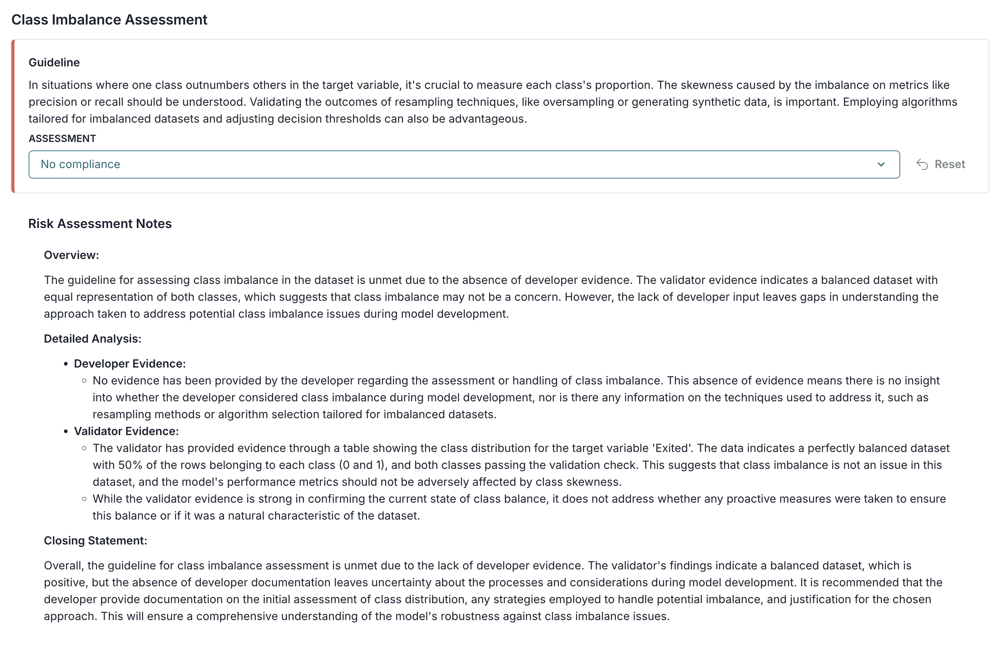

---
# Copyright © 2023-2026 ValidMind Inc. All rights reserved.
# Refer to the LICENSE file in the root of this repository for details.
# SPDX-License-Identifier: AGPL-3.0 AND ValidMind Commercial
title: "Finalizing  Validation Reports"
subtitle: "Validator Fundamentals — Module 4 of 4  _Click [](#learning-objectives) to start_"
lightbox: true
format:
  revealjs:
    include-in-header:
      - text: |
          
    controls: true
    controls-tutorial: true
    help: true
    controls-back-arrows: visible
    transition: slide
    theme: [default, ../assets/slides.scss]
    slide-number: true
    chalkboard: false
    preview-links: auto
    view-distance: 2
    logo: /favicon.svg
    footer: " | [Home ](/training/training.qmd)"
    revealjs-plugins:
      - slideover
  html:
  # Change this to the file name prepended by a _ to get around the global HTML output settings required by _metadata.yml
    output-file: _finalizing-validation-reports.html
    search: false
title-slide-attributes:
  data-background-color: "#083E44"
  data-background-image: "../assets/home-hero.svg"
skip_preview: true
---

# Learning objectives {.center}

_"As a **validator** who has logged validation tests with the  to the , I want to refine my validation report, submit my validation report for approval, and track artifact (finding) resolution and other updates."_

::: {.tc}
 
This final module is part of a four-part series:
  
[Validator Fundamentals](/training/validator-fundamentals/validator-fundamentals-register.qmd){.button target="_blank"}
:::

## Module 4 — Contents {.center}

:::: {.columns .f3}

::: {.column width="50%" .mt4 .pr4}
### Section 1

- [Refine validation report](#refine-validation-report)
- [Manage artifacts](#manage-artifacts)
- [Submit validation report for approval](#submit-report-for-approval)

:::

::: {.column width="50%" .mt4}
### Section 2

- [Collaborate with others](#collaborate-with-others)
- [Track activity](#track-activity)
- [View analytics](#view-analytics)

:::

::::

First, let's make sure you can log in to .



## Before you begin {.center}

::: {.panel-tabset}

### Prerequisite courses

To continue, you need to have been [onboarded](validator-fundamentals-register.qmd#register){target="_blank"} onto  with the [** Validator**]{.bubble} role and completed the first three modules of this course:

<!-- IMPORTANT: USE THE .HTML PATH AND NOT THE .QMD PATH FOR THE REVEALJS OUTPUT -->

:::: {.columns}
::: {.column width="30%"}
::: {.tc}
[Module 1](using-validmind-for-validation.html){.button target="_blank"}
:::

:::
::: {.column width="30%"}
::: {.tc}
[Module 2](running-data-quality-tests.html){.button target="_blank"}
:::

:::

::: {.column width="30%"}
::: {.tc}
[Module 3](developing-potential-challengers.html){.button target="_blank"}
:::

:::
::::

:::: {.tc .mt5 .f2 .embed}
Already logged in and refreshed this module? Click []() to continue.

:::



:::

# Section 1 {background-color="#083E44" background-image="/assets/img/about-us-esphere.svg"}

# Refine validation report {background-color="#083E44" background-image="/training/assets/home-hero.svg"}

## {.scrollable}

:::: {.columns}
::: {.column width="30%" .pr4 .f2}
Make qualitative edits

::: {.f5 .nt2 .pl2 .mb4}
(Scroll down for the full instructions.)
:::

::: {.tc}
[Learn more ...](/guide/documentation/work-with-content-blocks.qmd){.button target="_blank"}

:::

 Try it **live** on the next page. 
:::

::: {.column width="70%" .bl .pl4 .f4}

::: {.panel-tabset}

### Add content blocks

1. From the ** Inventory** in the , go to the model you connected to earlier.

2. In the left sidebar that appears for your model, click **Validation** under  Documents.

3. Click on **1. Executive Summary** to expand and add content to that section.

4. Hover your mouse over the space where you want your new block to go until a horizontal line with a  sign appears that indicates you can insert a new block:

  {width=90% fig-alt="A gif showing the process of adding a content block in the UI" .screenshot}

After adding the block to your validation report, generate a content draft with AI using the [content editing toolbar](/guide/documentation/work-with-content-blocks.qmd#content-editing-toolbar){target="_blank"}:



### Edit test result descriptions
You can also use the content editing toolbar to revise the description of test results to explain the changes made to the raw data and the reasons behind them.

For example:

1. Within your validation report, click on **2.2.1. Data Quality** to expand that section and locate the linked Class Imbalance Assessment evidence.

2. Click **See evidence details** to review the LLM-generated description that summarizes the test results, that confirm that our final preprocessed dataset actually passes our test.

<!-- NEED A NEW IMAGE WHEN TESTED -->

3. Edit the description for our individually inserted `ClassImbalance:raw_dataset_preprocessed` test:

  {fig-alt="Screenshot showing the editor for a test result description" .screenshot}

:::

:::
::::

## {background-iframe="https://app.prod.validmind.ai/model-inventory" background-interactive="true" data-preload="yes"}

:::: {.slideover--b .auto-collapse-10}
::: {.tc}
**Add & edit content blocks**
:::

1. Select the name of your model you registered for this course to open up the model details page.
2. On the left sidebar that appears for your model, click **Validation** under  Documents.
3. Click on **1. Executive Summary** to add and edit a content block.
4. Click on **2.2.1. Data Quality** to edit the description for the linked Class Imbalance Assessment test results.

When you're done, click []() to continue.

::::

## {.scrollable}

:::: {.columns}
::: {.column width="30%" .pr4 .f2}
Automatically map & assess evidence

::: {.tc}
[Learn more ...](/guide/validation/map-and-assess-evidence.qmd){.button target="_blank"}
:::

:::

::: {.column width="70%" .bl .pl4 .f3}



:::
::::

## {.scrollable}

:::: {.columns}
::: {.column width="30%" .pr4 .f2}
Map & assess evidence

::: {.f5 .nt2 .pl2 .mb4}
(Scroll down for the full instructions.)
:::

 Try it **live** on the next pages. 
:::

::: {.column width="70%" .bl .pl4 .f4}

1. In the left sidebar, click ** Inventory**.

2. Select a record or find your record by [applying a filter or searching for it](/guide/inventory/working-with-the-inventory.qmd#search-filter-and-sort-records){target="_blank"}.

3. In the left sidebar that appears for your record, click **Validation** under ** Documents**.

::: {.panel-tabset}

### Map evidence to guidelines



### Assess evidence for compliance



:::

:::
::::

## {background-iframe="https://app.prod.validmind.ai/model-inventory" background-interactive="true" data-preload="yes"}

:::: {.slideover--b .auto-collapse-10}
::: {.tc}
**Map evidence to guidelines**
:::

1. Select the name of your model you registered for this course to open up the model details page.
2. On the left sidebar that appears for your model, click **Validation** under  Documents.
3. Navigate to a section and expand the **Evidence** panel.
4. Click ** Map Evidence**.
5. Configure the mapping options, then click **Map Evidence** to run the AI mapping.
6. Review and approve the mapped evidence.

When you're done, click []() to continue.

:::

## {background-iframe="https://app.prod.validmind.ai/model-inventory" background-interactive="true" data-preload="yes"}

:::: {.slideover--b .auto-collapse-10}
::: {.tc}
**Assess evidence for compliance**
:::

1. Select the name of your model you registered for this course to open up the model details page.
2. On the left sidebar that appears for your model, click **Validation** under  Documents.
3. Navigate to a section that has linked evidence.
4. Expand the **Evidence** panel and click ** Assess Evidence**.
5. After the AI analyzes the linked evidence and generates an **Evidence Assessment**, review and approve the evidence assessment.

When you're done, click []() to continue.

:::

## {.scrollable}

:::: {.columns}
::: {.column width="30%" .pr4 .f2}
Refine compliance assessments

::: {.f5 .nt2 .pl2 .mb4}
(Scroll down for the full instructions.)
:::

::: {.tc}
[Learn more ...](/guide/validation/assess-compliance.qmd#provide-compliance-assessments){.button target="_blank"}

:::

 Try it **live** on the next page. 
:::

::: {.column width="70%" .bl .pl4 .f4}

After  generates a draft compliance assessment for your review, you'll need to refine your assessments to ensure they are accurate and complete:

::: {.panel-tabset}

### Add risk assessment notes

1. From the ** Inventory** in the , go to the model you connected to earlier.

2. In the left sidebar that appears for your model, click **Validation** under  Documents.

3. Click on **2.2.1. Data Quality** to expand that section and locate the Class Imbalance Assessment sub-section.

4. Click under **Risk Assessment Notes** to edit the content block using the content editing toolbar.

    For example, use ** [beta]{.smallcaps} (Generate Text with AI)** to create a draft summarizing the contents of the Class Imbalance Assessment sub-section.

      {width=90% fig-alt="A screenshot showing a sample compliance assessment" .screenshot}

### Provide compliance assessments



:::

:::
::::

## {background-iframe="https://app.prod.validmind.ai/model-inventory" background-interactive="true" data-preload="yes"}

:::: {.slideover--b .auto-collapse-10}
::: {.tc}
**Refine your compliance assessments**
:::

1. Select the name of your model you registered for this course to open up the model details page.
2. On the left sidebar that appears for your model, click **Validation** under  Documents.
3. Click on **2.2.1. Data Quality** to refine the compliance assessment for the Class Imbalance Assessment sub-section.

When you're done, click []() to continue.

:::



 
Learn how to **use the  to review validation reports** on the next page. 

## {.scrollable}

:::: {.columns}
::: {.column width="30%" .pr4 .f2}
Use the 

::: {.f5 .nt2 .pl2 .mb4}
(Scroll down for the full instructions.)
:::

 Try it **live** on the next page. 
:::

::: {.column width="70%" .bl .pl4 .f4}



:::

::::

## {background-iframe="https://app.prod.validmind.ai/model-inventory" background-interactive="true" data-preload="yes"}

:::: {.slideover--b .auto-collapse-10}
::: {.tc}
**Check your validation report**
:::

1. Select the name of your model you registered for this course to open up the model details page.
2. On the left sidebar that appears for your model, click **Validation** under  Documents.
3. Locate  Check Document on the right and click to expand the menu, then click ** Check Document**.
4. Select a **[regulation]{.smallcaps}** and an associated **[assessment]{.smallcaps}** from the drop-down menus to to check your report against.
5. Scroll to the bottom and click **Check Validation Document**.
6. After the  has completed its analysis, expand individual questions or click **Expand All** to look through the observations.

When you're done, click []() to continue.

::::

# Manage artifacts {background-color="#083E44" background-image="/training/assets/home-hero.svg"}

## {.scrollable}

:::: {.columns}
::: {.column width="30%" .pr4 .f2}
Add more artifacts

::: {.f5 .nt2 .pl2 .mb4}
(Scroll down for the full instructions.)
:::

::: {.tc}
[Learn more ...](/guide/validation/add-manage-artifacts.qmd){.button target="_blank"}

:::

 

Try it **live** on the next pages. 

:::

::: {.column width="70%" .bl .pl4 .f4}

Along with adding artifacts directly via validation reports, you can also add artifacts during your review of  documentation:



:::
::::

## {background-iframe="https://app.prod.validmind.ai/model-inventory" background-interactive="true" data-preload="yes"}

:::: {.slideover--b .auto-collapse-10}
::: {.tc}
**Add an artifact on documentation**

<!-- **Add an artifact via overview** -->
:::

1. Select the name of your model you registered for this course to open up the model details page.
2. On the left sidebar that appears for your model, click **Development** under  Documents.
3. Click ** Add Model Artifact** to add an artifact from the overview.

When you're done, click []() to continue.

:::

<!-- ## {background-iframe="https://app.prod.validmind.ai/model-inventory" background-interactive="true" data-preload="yes"}

:::: {.slideover--b .auto-collapse-10}
::: {.tc}
**Add an artifact via section**
:::

1. Select the name of your model you registered for this course to open up the model details page.
2. On the left sidebar that appears for your model, click **Development** under  Documents.
3. Click on any section heading to expand and add an artifact to that section via the ** Insights™** panel.

When you're done, click []() to continue.

::: -->

## {.scrollable}

:::: {.columns}
::: {.column width="30%" .pr4 .f2}
Track issue resolution

::: {.f5 .nt2 .pl2 .mb4}
(Scroll down for the full instructions.)
:::

::: {.tc}
[Learn more ...](/guide/validation/add-manage-artifacts.qmd#track-issue-resolution){.button target="_blank"}
:::

 Try it **live** on the next pages. 
:::

::: {.column width="70%" .bl .pl4 .f4}
As you prepare your report, review open or past due artifacts, close resolved ones, or add a mitigation plan:

::: {.panel-tabset}

### Update an artifact



### View all artifacts

Along with model-specific artifacts, you can also view and filter a list of artifacts across all models within the :



:::

:::
::::

## {background-iframe="https://app.prod.validmind.ai/model-inventory" background-interactive="true" data-preload="yes"}

:::: {.slideover--b .auto-collapse-10}
::: {.tc}
**Update your validation issue**
:::

1. Select the name of your model you registered for this course to open up the model details page.
2. In the left sidebar that appears for your model, click ** Validation Issues**.
3. Select the validation issue you logged during this course, and make some changes to any of the fields.
4. When you are finished editing, set the valildation issue **[status]{.smallcaps}** to `Closed`.

When you're done, click []() to continue.

:::

## {background-iframe="https://app.prod.validmind.ai/validation-issues" background-interactive="true" data-preload="yes"}

:::: {.slideover--b .three-quarters .auto-collapse-10}
::: {.tc}
**View all  Validation Issues**
:::

Filter this list to include only validation issues you want to see, or toggle visibilty for column headers.

When you're done, click []() to continue.

:::

# Submit report  for approval {background-color="#083E44" background-image="/training/assets/home-hero.svg"}





# Section 2 {background-color="#083E44" background-image="/assets/img/about-us-esphere.svg"}

# Collaborate with others {background-color="#083E44" background-image="/training/assets/home-hero.svg"}

## {.scrollable}

:::: {.columns}
::: {.column width="30%" .pr4 .f2}
Comment threads

::: {.tc}
[Learn more ...](/guide/documentation/collaborate-with-others.qmd){.button target="_blank"}
:::

 Try it **live** on the next page. 
:::

::: {.column width="70%" .bl .pl4 .f3}
::: {.f5 .nt2}
:::



Have a question about the record? Collaborate with your developer right in the documentation:

::: {.panel-tabset}



:::

:::

::::

## {background-iframe="https://app.prod.validmind.ai/model-inventory" background-interactive="true" data-preload="yes"}

:::: {.slideover--b .auto-collapse-10}
::: {.tc}
**Comment on a text block**
:::

1. Select the name of your model you registered for this course to open up the model details page.
2. On the left sidebar that appears for your model, click **Validation** under  Documents.
3. **In the content block you added earlier**: Post a comment, reply to it, and then resolve the thread.

When you're done, click []() to continue.

::::

# Track activity {background-color="#083E44" background-image="/training/assets/home-hero.svg"}





# View analytics {background-color="#083E44" background-image="/training/assets/home-hero.svg"}

## {background-iframe="https://app.prod.validmind.ai" background-interactive="true" data-preload="yes"}

:::: {.slideover--r .three-quarters .auto-collapse-10}
**Welcome to  Analytics**

Under analytics, you can find executive summaries, track information on records (models), artifacts, and more.

For example:

1. Select **Validation Issues** to review reports on validation issues.
2. Click into any widget to review the validation issues reported by that widget.

When you're done, click []() to continue.

::::

# In summary {background-color="#083E44" background-image="/training/assets/home-hero.svg"}

## {.scrollable .center}

:::: {.columns}
::: {.column width="30%" .pr4 .f2}
Finalizing validation reports

::: {.f3}
 Want to learn more? Find your next learning resource on [ ](/training/training.qmd){target="_blank"}.

:::

:::

::: {.column width="70%" .bl .pl4 .f4}
In this final module, you learned how to:

- [x] Add or edit content blocks in your validation report
- [x] Assess the compliance of a record (model) within your validation report
- [x] Manage artifacts via multiple methods
- [x] Submit your validation report for approval
- [x] Collaborate with other stakeholders
- [x] Track updates on your model
- [x] Navigate the analytics dashboard
:::
::::

::: {.f3}
 
There is more that  can do to help you validate records, from using your own template to code samples you can adapt for your own use case:
  
:::

::: {.tc}
[All validation guides](/guide/guides.qmd#validation){.button target="_blank"}

:::