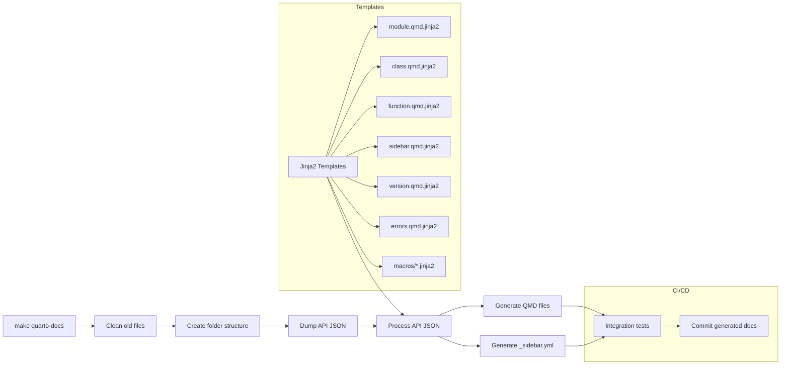

# Generating Quarto Markdown for the Python API

This directory includes templates, macros, CSS, and Quarto Markdown output for generating the ValidMind Library (Python API) reference documentation for our docs site.

- `templates/` — Jinja2 templates and macros for generating Quarto Markdown
- `validmind.css` — CSS for Python API reference styling
- `_metadata.yml` — Quarto configuration file
- `_sidebar.yml` — Generated sidebar navigation fragment for Quarto
- `validmind.qmd`, `validmind/` — Generated API documentation matching the codebase and pdoc structure

## Testing locally

To generate Quarto Markdown locally:

```sh
make quarto-docs
```

## How it works

1. Griffe extracts API information from the API codebase and dumps it to a JSON file 
2. A Python script extracts API information from the JSON, processes it, and passes it to Jinja2 templates
3. Jinja2 templates and shared macros transform this information into Quarto Markdown files
4. A sidebar navigation fragment is generated based on the output file structure
5. CI/CD integration tests the Quarto docs generation and commits the output
6. Documentation repo: Integrates the Quarto files with the docs site source



### `Makefile`

- `make quarto-docs` — Generates Quarto Markdown from the Python API
- `make python-docs` — In the documentation repo: Clones this repo, copies the generated Quarto Markdown files over into the docs site source

### GitHub actions

- `.github/integration.yaml` and `.github/python.yaml` — Tests Quarto Markdown generation
- `.github/quarto-docs.yaml` — Generates and commits Quarto Markdown docs

### Jinja2 Templates

Located in `templates/`, these define how Quarto Markdown is output:

- `module.qmd.jinja2` — Documents Python modules, including functions and classes
- `version.qmd.jinja2` — Displays library version information
- `class.qmd.jinja2` — Details class documentation with inheritance and methods
- `function.qmd.jinja2` — Formats functions, parameters, and return values
- `errors.qmd.jinja2` — Documents error classes with sorting
- `sidebar.qmd.jinja2` — Generates navigation structure
- `macros/docstring.jinja2` — Parses and structures Google-style docstrings
- `macros/signatures.jinja2` — Formats function signatures and parameters
- `macros/types.jinja2` — Handles complex type annotations
- `macros/decorators.jinja2` — Documents function and class decorators
- `macros/navigation.jinja2` — Generates page linking

### Python script

Located in `scripts/generate_quarto_docs.py`, handles the Quarto Markdown generation:

- Extracts API data using Griffe.
- Processes data with Jinja2 templates.
- Lints and writes output to `docs/`

#### Features

- **Private/public filtering** — Controls which members are included
- **Root module handling** — Special processing for the `validmind` module
- **Alias resolution** — Maps imported symbols to original definitions
- **Docstring normalization** — Cleans up formatting inconsistencies
- **Inherited members** — Documents inherited methods, especially for error classes
- **Errors module handling** — Sorts and structures error class documentation
- **Class discovery** — Finds and documents classes across modules
- **Test suite handling** — Documents test suites and their aliases
- **VM models handling** — Ensures proper documentation of core model classes
- **Exclusions** — Omits internal utilities and logging helpers
- **Sidebar generation** — Builds hierarchical navigation from module structure
