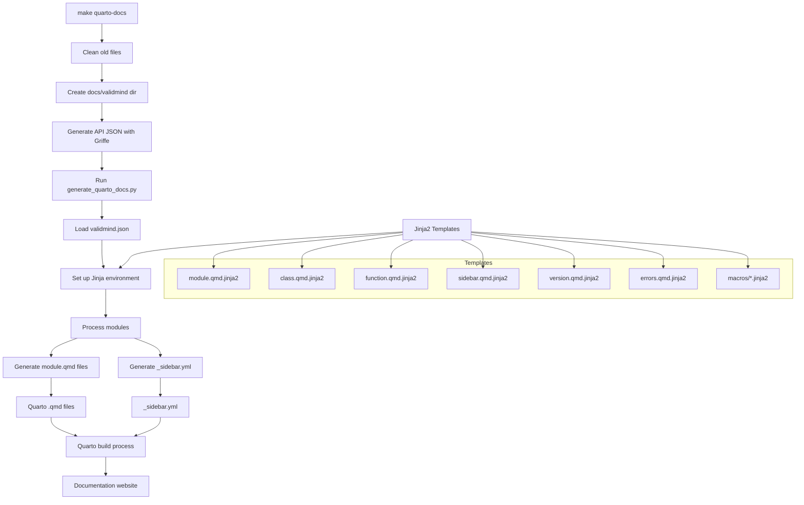

# Generating Quarto Markdown for the Python API

This directory contains the framework for generating ValidMind Library API documentation for inclusion in our Quarto docs site. The documentation is generated from a JSON dump of the Python API using a combination of Jinja2 templates, a custom Python script, and the `make quarto-docs` Makefile action.

## How it works

The `make quarto-docs` command orchestrates the workflow:

1. **Dump JSON for the Python API**
   - Cleans old documentation files
   - Creates the output directory structure at `docs/validmind/`
   - Uses Griffe to extract API information from the Python codebase
   - Generates a structured `docs/validmind.json` file

2. **Generate documentation**
   - Runs the `generate_quarto_docs.py` script:
   - The script processes the JSON data with Jinja2 templates 
   - Recursively handles modules, classes, and functions
   - Creates Quarto markdown files (.qmd) for all API components
   - Generates a sidebar navigation file (_sidebar.yml)

The QMD files are organized to match the Python package structure (which also matches the pdoc HTML file structure) and are ready to be included in the docs site via `make python-docs` from the documentation repo.

## Components

### QMD templates

The `templates/` directory contains Jinja2 templates used to generate documentation:

- **module.qmd.jinja2** — Main template for module documentation. Processes Python modules and outputs Quarto markdown with proper formatting for module documentation.
- **class.qmd.jinja2** — Template for class documentation. Includes inheritance, methods, properties, and examples.
- **function.qmd.jinja2** — Template for function documentation. Formats function signatures, parameters, return values, and examples.
- **sidebar.qmd.jinja2** — Generates the navigation sidebar for the documentation website.
- **version.qmd.jinja2** — Creates a version information page.
- **errors.qmd.jinja2** — Specialized template for documenting error classes with proper categorization.
- **macros/** — Directory containing reusable Jinja2 macros for common documentation elements.

### Quarto supporting files

- **_metadata.yml** — Configuration file for Quarto
- **validmind.css** — Custom stylesheet for the API reference

### A magic Python script

- **generate_quarto_docs.py** — A Python script that:
  - Parses the API JSON data generated by Griffe
  - Applies the Jinja2 templates and macros to generate Quarto markdown
  - Creates a structured sidebar
  - Outputs files in the `docs/` and `docsvalidmind/` folders
  - Handles some special cases like aliases, inherited members, and private/public member filtering

## Extending or modifying Quarto Markdown generation

To modify the documentation generation:

1. **Templates** — Edit the Jinja2 templates and macros in `docs/templates/` to change the output
2. **Script** — Modify `generate_quarto_docs.py` to change the processing logic
3. **Style** — Edit `validmind.css` for visual changes

After making changes, run `make quarto-docs` to regenerate the documentation.
