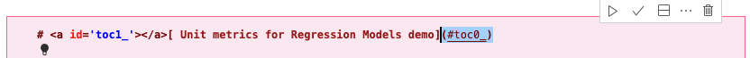
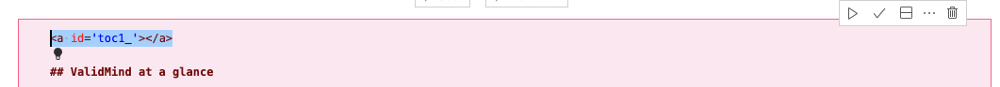
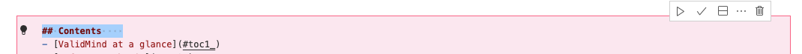
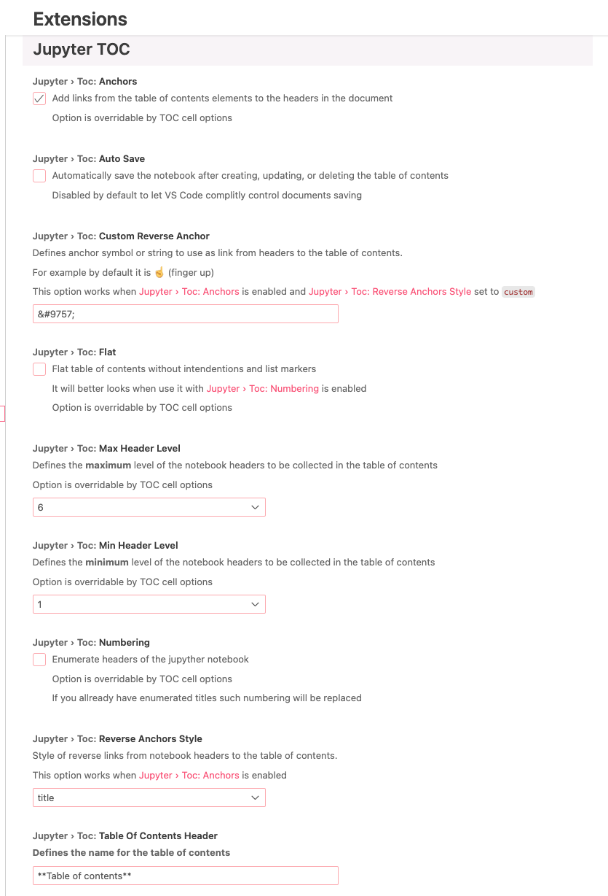
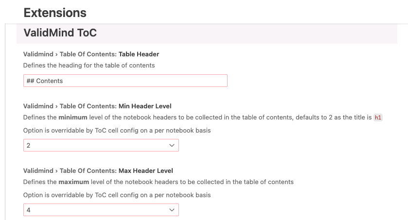

# ValidMind Jupyter Notebooks — Table of Contents

This VS Code extension based off of [xelad0m/vscode-jupyter-toc](https://github.com/xelad0m/vscode-jupyter-toc) is customized for ValidMind's Jupyter Notebook conventions. 

The extension functions more or less the same with the following differences:

<details>
  <summary><b>Version comparision</b></summary>
  
| Original ver. | ValidMind ver. | Notes |
|---|---|---|
|   |  | Page anchors set above header instead of inset; original version was not parsed correctly by Quarto and broke the native ToC, no reverse anchors to top in page anchors |
|  || Top anchor in table of contents cell removed, default heading changed |
|  |  | Reduced global settings, defaults set to ValidMind conventions |
</details>


## User guide

Refer to the [User guide](installation/README.md) for installation and user instructions.

## Updating the extension

### Key files

- **[`src/extension.ts`](src/extension.ts)** — This TypeScript code controls the core functionality of the extension.
- **[`package.json`](package.json)** — This JSON file includes the versioning and the setup for the VS Code global settings display under [`contributes.configuration`](https://code.visualstudio.com/api/references/contribution-points#contributes.configuration). 

### Before you begin

Make sure you're in the `documentation` repo in the `validmind-toc` directory:

```bash
cd validmind-toc
```

You'll need to install the dependencies required for you to work on the extension for the first time:

```bash
npm install
```

### Updating the version

Before you re-package the extension, make sure to bump the version so we can keep track of changes:

```bash
npm version patch
```

### Exporting the extension

Compile the code:

```bash
npm run compile
```

Install [`@vscode/vsce`](https://github.com/microsoft/vscode-vsce) locally in your project directory:

```bash
npm install @vscode/vsce
```

Package the extension and move the exported file into the `installation` directory:

```bash
px vsce package && mv *.vsix installation
```

